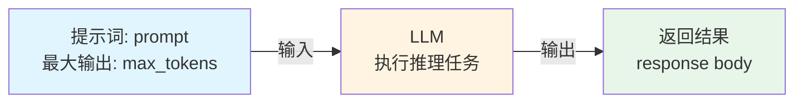

# 0.1 什么是Agentic AI？

> **本章重点**：理解AI Agent与Agentic AI的本质区别，建立对新一代智能系统的准确认知

## 🎯 核心问题

在人工智能快速发展的今天，我们经常听到"AI Agent"和"Agentic AI"这两个概念。它们到底有什么区别？为什么说Agentic AI是通向AGI应用的关键前站？本章将为您解答这些核心问题。

---
## Agent 概念溯源

在开始这段技术演进之旅前，我们有必要先理解一个关键概念——**Agent（智能体）**。

Agent这个概念在人工智能领域由来已久，最早在20世纪60年代，"人工智能之父"马文·明斯基在他的研究中首次明确使用了"Agent"一词，将其定义为一种自主运行的计算或认知实体，具备感知环境、推理决策和执行任务的能力。

从马文·明斯基提出"Agent"概念至LLM模型诞生前，AI Agent的发展经历了四个主要阶段，每个阶段在技术特点和应用场景上都有显著差异：

| 阶段 | 时期 | 核心特征 | 代表案例 | 优势与局限 |
|------|------|----------|----------|-----------|
| **Symbolic Agent** （符号Agent） | 1960s-1980s | 基于规则和逻辑的符号主义 | 专家系统 | 擅长特定领域推理，但缺乏灵活性和学习能力 |
| **Reactive Agent** （反应式Agent） | 1990s | 强调对环境的实时响应 | Roomba吸尘器 | 简单高效，但无法处理复杂任务 |
| **RL-based Agent** （强化学习Agent） | 2000s初 | 通过试错获得学习能力 | AlphaGo | 动态环境适应性强，但训练成本高昂 |
| **Transfer & Meta Learning Agent** （迁移学习与元学习Agent） | 2010s | 跨任务迁移知识，学会如何学习 | 小样本学习系统 | 小样本学习表现优异，但计算复杂度高 |

理解了这些背景后，我们就能更好地认识到：**LLM的出现为何会成为Agent发展史上的分水岭**。接下来，让我们正式进入从LLM到Agentic AI的演进历程。

## 阶段一： 裸大模型调用时期
2022年11月30日，OpenAI发布GPT-3.5，引发全球轰动，开启了大语言模型时代。这一阶段的应用模式最为简单：**裸大模型调用**——类似后端API调用，输入提示词（Prompt），模型执行推理后直接返回结果。处理逻辑如下：

## 阶段二： LLM-Based Agent探索
LLM诞生后，立即催生出了新一代的Agent，即LLM-Based Agent。2023年春季在开源社区就诞生了基于LLM来搭建的Agent项目，其中以AutoGPT与BabyAGI两个项目最具代表性。它们共同推动了"LLM Agent"从理论概念走向大众实践，成为该领域发展的重要里程碑。这类项目首次展示了让LLM全自主管理复杂任务的能力。它们通过"生成–执行–反馈"的循环机制，结合浏览器、文件操作等插件，实现了对高层目标的分解与逐步推进。尽管存在效率有限与任务处理深度不足等问题，但这类项目展示了基于LLM让软件系统自动连贯执行任务的潜力。一时间，"让我来告诉ChatGPT干完这件事"的畅想变成了现实雏形，AutoGPT的GitHub星标飙升，在技术圈掀起了讨论自主AI代理的热潮。

### LLM的“手和脚”——LLM Function Calling诞生
不过，AutoGPT等项目在初期也暴露出诸多问题，例如：经常调用工具失败、经常生成无效方案或陷入循环，效率低下，以及对稍复杂任务仍显力不从心。为了减少胡乱调用工具的情况，更规范函数调用，2023年6月由OpenAI在其GPT-4和GPT-3.5-Turbo模型的Chat Completions API中正式推出了LLM Function Calling。LLM Function Calling要求模型输出结构化的函数名和参数，从而安全地调用外部API，让Agent行为更加可控。至此，大模型厂商正式为LLM这个“大脑”装上了“手和脚”，使基于LLM的AI从一个被动的“对话者”，进化成了一个主动的“行动者”。这一举措催生了一个庞大的“LLM-Based Agent”（智能体）开发生态，也让Agent概念走出了研究圈子和技术圈，进入大众产品应用，从此AI Agent这一概念开始频繁出现在AI相关的宣传领域中。

## AI Agent 与 LLM-Based Agent 

从概念关系上看，**LLM-Based Agent是AI Agent的一个特殊子集**，它继承了AI Agent的核心特征（自主性、任务专一性、反应性与适应性），同时通过LLM的强大推理能力和Function Calling机制，极大地改变了AI Agent的实现方式——让Agent从依赖复杂规则和训练，转变为通过自然语言理解和推理来执行任务。

随着LLM-Based Agent技术的快速发展和广泛应用，其在实践中的表现已经成为了AI Agent的典型代表。因此，在当前的AI应用开发领域，当我们讨论"AI Agent"时，通常指的就是基于大语言模型的智能体系统。这种术语使用的演变反映了技术发展的现实：LLM-Based Agent继承了AI Agent的理论基础，并在实践中成为了AI Agent概念的主流实现形式。

## 阶段三： 从单一到多元，协作模式的探索（2023年 - 2024年）

随着智能体框架的出现，单智能体技术趋于成熟，但在实际应用中，其局限性也迅速暴露出来。

### 单智能体的局限性

单个AI Agent就像一位领域专家，在特定任务上表现出色，但面对复杂问题时局限性明显。这就好比让一个人同时担任"产品经理 + 设计师 + 前端工程师 + 后端工程师"，看似高效，实则容易职责混乱、注意力分散。

强行让单个Agent承担多领域职责会带来以下问题：

**1. Token爆炸与工具选择幻觉**
对于跨领域的复杂任务，单个Agent的提示词中必须注入海量信息：系统指令、交互历史、庞大的工具库定义、多步骤执行上下文等。随着任务推进，上下文像滚雪球般膨胀，即便采用百万级长上下文窗口，也只是推迟问题的爆发。当模型陷入"信息沼泽"时，其注意力被严重稀释，关键信息被淹没，直接引发"工具选择幻觉"：混淆相似工具、错误调用API、幻觉出不存在的参数，最终导致任务失败。

**2. 维护与扩展的复杂性**
当业务需求变化时，修改一个"全能型"Agent的内在逻辑，远比调整专注于单一任务的Agent困难得多（牵一发而动全身）。在生产环境中，每次修改系统提示词都伴随着巨大的调试成本和不可预测的风险。

**3. 单点故障风险**
单个Agent在任务执行的任何环节出错，整个任务链就会中断。系统缺乏自我纠错和寻找替代方案的机制，鲁棒性和容错性严重不足。

面对单智能体的这些局限性，开发者和研究者们逐渐意识到多智能体的优势。通过将复杂任务分解为多个子任务，并分配给专业化的Agent来执行，多智能体系统能够有效克服单智能体的不足，展现出显著的优势。

### 多Agent的核心优势
**1. 专业分工与注意力聚焦**
将复杂目标分解为具体子任务，分配给领域专家Agent执行。每个Agent专注于自身擅长领域，"注意力"高度集中，任务执行产生的上下文内聚在领域内，只对外输出必要信息。这种专业化分工极大提升了任务质量和效率，有效降低了因任务复杂导致的幻觉风险。

**2. 灵活扩展与快速迭代**
当需要新功能时，只需开发专业Agent并接入现有协作框架，无需改造整个系统。架构清晰、维护简单，能够快速响应业务需求变化。

**3. 容错机制与高可靠性**
通过系统设计和流程编排构建容灾能力：某个Agent执行失败时，协调者可重新分配任务给备用Agent，或调整策略继续执行。系统消除了"单点故障"，容错能力和稳定性显著提升，满足企业级关键业务要求。

### 多智能体与 Context Engineering 

在多智能体协作系统中，任务执行模式类似于一个专业团队：一个"PM Agent"统筹全局，负责任务分解、进度协调和结果整合；多个"专业领域 Agent"各司其职，分别负责产品设计、UI设计、前端开发、后端开发等具体子任务。这种协作模式带来了一个核心挑战：**如何在多个Agent之间高效、准确地传递上下文信息？** 这直接决定了多智能体系统的成败。正因如此，在2025年初，AI领域的领军人物如Tobi Lütke和Andrej Karpathy等人开始强调**Context Engineering（上下文工程）**的重要性。越来越多的开发者和研究者也认识到Context Engineering成为多智能体系统研发中的重中之重，它不仅仅是简单的信息传递，而是一门精妙的工程与语言的艺术：

### Context Engineering 的核心价值
1. **精准的信息组装**：在合适的时机，为每个Agent组装整合最合适的Prompt和上下文信息，确保Agent能够准确理解任务要求和执行环境。
2. **上下文窗口的优化利用**：在有限的Token预算内，填入"恰到好处"的信息——既不能信息不足导致Agent理解偏差，也不能信息冗余导致关键信息被稀释。
3. **任务一致性的保障**：确保每个子任务Agent都能准确理解整体任务目标，避免子任务执行偏离主航道，保证所有子任务协同服务于整体目标。
4. **执行效率的提升**：通过精心设计的上下文传递机制，减少Agent之间的无效交互，提升任务执行的可靠性和效率。
在多智能体系统中，Context Engineering 的质量直接决定了系统的智能涌现程度：优秀的上下文工程能够让多个Agent的协作产生"1+1>2"的效果，而糟糕的上下文管理则可能导致系统陷入混乱或产生错误的结果。

## 阶段四： 多智能体蓬勃发展

在认识到多智能体协作的优势后，开发者们开始通过代码或低代码平台构建基于预定义流程的多智能体workflow系统。这类确定性的workflow需要多个AI角色按照既定流程协同工作，既保留了单智能体的稳定性，又能通过预定义流程完成一系列任务，最终完成一项复杂任务。

以n8n、Dify、Coze等低代码平台为代表的工作流式平台大行其道，其核心是预先编排好的任务路径。这种模式的可控性极高、结果稳定可预测，但牺牲了系统的自主性和灵活性，更像一个高效的自动化执行器。
**Workflow AI Agents（工作流式多智能体）**采用确定性的流程设计：
- **确定性流程**：通过预定义的流程编排，程序化地使用AI能力
- **可预测结果**：追求确定性的流程产生确定性的结果，强调稳定性和可控性
- **应用场景**：适合需要高可靠性和可预测性的企业级自动化场景

### Agentic AI概念崛起

与Workflow AI Agents追求确定性流程不同，一部分研究者和开发者开始探索更高层次的智能系统——一个能够像人类助手一样自主思考、动态规划、灵活执行的超级智能伙伴。这就是**Agentic AI**的核心理念：追求将所有的工作内容都交给AI自主完成，从任务理解、流程设计到具体实施，实现全流程的智能化代理。
2024年3月，吴恩达首次公开提出Agentic AI概念，英伟达CEO黄仁勋于2025年3月将其列为生成式AI后的重要发展阶段，标志着Agentic AI从学术概念正式进入产业视野。阿里巴巴在2025年11月战略规划中明确当前AI技术已进入Agentic AI阶段。

### Agentic AI的定义

目前对Agentic AI的定义主要来自两个视角：
**百科定义视角（2025年10月版）**：**Agentic AI**（代理式人工智能）是人工智能领域的新兴方向，其核心特征在于能够通过自主感知、推理、规划与执行，独立完成复杂多步骤任务。相较于工作流类AI工具，它具备主动性、自治性和环境适应性，可脱离人类直接控制进行决策与交互。
**百科定义视角（2025年11月版）**：**Agentic AI**（代理式人工智能）是人工智能领域的新兴方向，其核心特征在于能够通过自主感知、推理、规划与执行，独立完成复杂多步骤任务，具备主动性、自治性和环境适应性。相较于传统AI工具，它可脱离人类直接控制进行决策与交互，通过感知→推理→执行→学习的闭环实现持续优化，能够跨应用程序调度任务并自主执行超50步操作。
**研究者定义视角**：**Agentic AI**是一种新兴的智能架构，利用多个专业化Agent协作来实现复杂且高层次的目标。这些系统由模块化的Agent组成，每个Agent负责更广泛目标的一个独特子组件，并通过集中式协调器或去中心化协议进行协调。

虽然各方对Agentic AI的定义侧重点不同，但都指向了同一个核心方向——**追求更高程度的自主性和代理能力**。为了更深入地理解这一概念，我们需要跳出字面定义，从本质层面来把握Agentic AI的核心内涵。

### Agentic AI的本质理解
从本质上看，Agentic AI（代理式人工智能）追求的是**最大程度的代理性和自主性**，让AI系统能够像人类助手一样，独立代理人类思考及处理复杂事务。正如吴恩达在演讲中所指出的："Agent" 是一个名词，代表具体的智能实体；而 "Agentic" 则是一个形容词，代表着一种**程度概念**——即系统具备代理能力的程度和自主性的水平。

这种"程度概念"揭示了Agentic AI的核心特征：**它不是一种固定的技术形态，而是一个从低到高的能力连续体**。不同系统在这个连续体上占据不同的位置——预设流程的Workflow AI工作流处于连续体的较低端，具备基础的自动化能力和简单的代理能力；而Cursor、Claude Code等编程助手则接近连续体的高端，展现出高度的自主性和动态规划能力。结合前文的定义可以看出，**只有当系统的自主性和代理能力达到一定阈值——能够自主感知、推理、规划与执行复杂任务时，才能称之为真正意义上的Agentic AI**。

### Agentic AI的核心特征
根据目前业界认可的Agentic AI项目或者软件工具， **Agentic AI**一般具有以下特征能力：
- **高度自主性**：无需人类持续干预，系统独立完成从任务理解、方案制定到执行验证的完整闭环
- **任务规划能力**：自主理解目标并分解为可执行的子任务，动态制定执行策略，无需人类预先设计流程
- **动态执行能力**：自主设计并执行多步骤工作流程，根据执行情况实时调整路径，无需预设固定流程
- **工具操控能力**：自主调用现有工具、按需创造新工具、验证执行结果，实现从意图到结果的自动化
- **环境适应能力**：持续感知环境变化、动态调整执行策略，必要时主动改造环境以适应任务目标

## 站在AGI回望Agentic AI

当我们站在AGI（通用人工智能）的终极愿景回望当下，会发现一个深刻的洞察：**AGI本质上就是人类的万能代理**，它能够像人类助手一样理解复杂意图、自主规划策略、动态调整执行路径，最终代理人类处理各类复杂事务。从这个角度看，Agentic AI正是通向AGI的关键前站——它通过多智能体协作、工具创造、自主执行等核心能力，逐步逼近AGI所要求的"万能代理"水平。

**Agentic AI的出现是人工智能领域的一场重大变革**，它代表了从"确定性自动化"向"智能自主代理"的自然进化，标志着AI系统从被动执行工具向主动智能伙伴的根本性转变。这种转变体现在三个关键维度：

- **从预设流程到自主规划**：传统自动化系统依赖预定义的流程和规则，而Agentic AI能够根据任务目标自主设计执行路径，动态调整策略
- **从单一执行到协作涌现**：单个Agent的能力边界有限，但多Agent协作能够产生智能涌现，实现"1+1>2"的系统级智能
- **从工具使用者到工具创造者**：Agentic AI不仅能调用现有工具，更能根据需求动态创造新工具，这种能力使其具备了无限扩展的可能性

正如人类从使用工具到创造工具的进化推动了文明的发展，Agentic AI系统从工具调用到工具创造的跃迁，也标志着智能系统自主能力的质的飞跃。Agentic AI正在通过这种持续的能力演进，逐步缩小与AGI愿景之间的差距。

