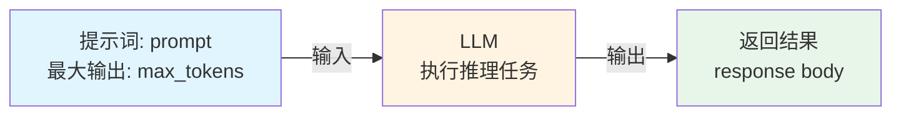
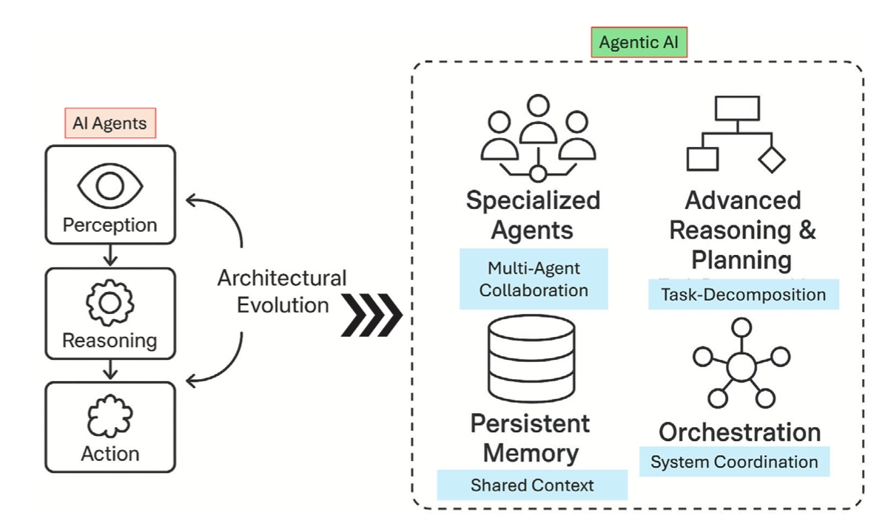
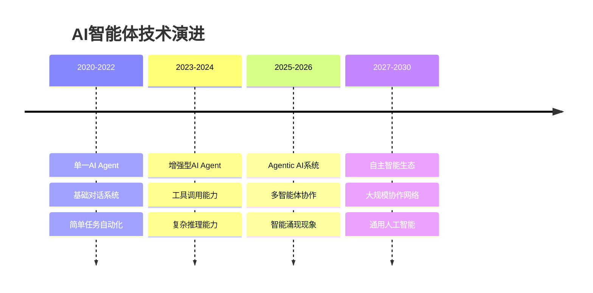

# 0.1 什么是Agentic AI？

> **本章重点**：理解AI Agent与Agentic AI的本质区别，建立对新一代智能系统的准确认知

## 🎯 核心问题

在人工智能快速发展的今天，我们经常听到"AI Agent"和"Agentic AI"这两个概念。它们到底有什么区别？为什么说Agentic AI是通向AGI应用的关键前站？本章将为您解答这些核心问题。

---

时间线
## 阶段一 裸大模型调用时期
2022年11月30日OpenAI发布GPT-3.5，引起社会轰动，让大家第一次认识到了大语言模型。自此开启了全球基于大语言模型的AI浪潮。
裸大模型调用，理解类似于后端接口调用，直接返回response body。处理逻辑如下图所示：



## Agent 概念由来
Agent,这个概念在人工智能领域由来已久，最早是20世纪60年代，“人工智能之父”马文·明斯基在他的研究中首次明确使用了“Agent”一词，将其定义为一种自主运行的计算或认知实体，具备感知环境、推理决策和执行任务的能力。
从马文·明斯基提出“Agent”概念至LLM模型诞生前，AI Agent的发展经历了四个主要阶段，每个阶段在技术特点和应用场景上都有显著差异。
Symbolic Agent（符号Agent）：20世纪60年代至80年代，基于符号主义的AI Agent以规则和逻辑为核心，典型例子是专家系统。这种Agent擅长特定领域的推理，但缺乏灵活性和学习能力。
Reactive Agent（反应式Agent）：20世纪90年代，行为主义催生了反应式Agent，强调对环境的实时响应。机器人领域的“Roomba”吸尘器是其代表，优点是简单高效，缺点是无法处理复杂任务。
RL-based Agent（基于强化学习的Agent）：21世纪初，强化学习（RL）的兴起让Agent具备了试错学习能力。DeepMind的AlphaGo是这一阶段的巅峰之作，展示了Agent在动态环境中的强大适应性，但训练成本高昂。
Agent with Transfer Learning and Meta Learning（迁移学习与元学习Agent）：2010年代，随着迁移学习和元学习的发展，Agent开始能够在不同任务间迁移知识，甚至学会如何学习。这种Agent在小样本学习中表现优异，但计算复杂度仍是一个瓶颈。


## 阶段二 LLM-Based Agent探索
所以LLM诞生后，立即催生出了新一代的LLM-Based Agent。2023年春季在开源社区就诞生了基于LLM来搭建的Agent项目，其中以AutoGPT与BabyAGI两个项目最具代表性。它们共同推动了“LLM Agent”从理论概念走向大众实践，成为该领域发展的重要里程碑。这类项目首次展示了让LLM全自主管理复杂任务的能力。它们通过“生成–执行–反馈”的循环机制，结合浏览器、文件操作等插件，实现了对高层目标的分解与逐步推进。尽管存在效率有限与任务处理深度不足等问题，但这类项目展示了基于LLM让软件系统自动连贯执行任务的潜力。一时间，“让我来告诉ChatGPT干完这件事”的畅想变成了现实雏形，AutoGPT的GitHub星标飙升，在技术圈掀起了讨论自主AI代理的热潮。

### LLM的“手和脚”——LLM Function Calling诞生
不过，AutoGPT等项目在初期也暴露出诸多问题：例如：经常调用工具失败、经常生成无效方案或陷入循环，效率低下，以及对稍复杂任务仍显力不从心。为了减少胡乱调用工具的情况，更规范函数调用，2023年6月由OpenAI在其GPT-4和GPT-3.5-Turbo模型的Chat Completions API中正式推出了LLM Function Calling。LLM Function Calling要求模型输出结构化的函数名和参数，从而安全地调用外部API，让Agent行为更加可控。至此，大模型厂商正式为LLM这个“大脑”装上了“手和脚”，使基于LLM的AI从一个被动的“对话者”，进化成了一个主动的“行动者”。这一举措催生了一个庞大的“LLM-Based Agent”（智能体）开发生态，也让Agent概念走出了研究圈子和技术圈，进入大众产品应用，从此这AI Agent一概念开始频繁出现在AI相关的宣传领域中。


## AI Agent 与 LLM-Based Agent 

从概念关系上看，**LLM-Based Agent是AI Agent的一个特殊子集**，它继承了AI Agent的核心特征（自主性、任务专一性、反应性与适应性），同时通过LLM的强大推理能力和Function Calling机制，极大地扩展和重新定义了AI Agent的能力边界。

随着LLM-Based Agent技术的快速发展和广泛应用，其在实践中的表现已经成为了AI Agent的典型代表。因此，在当前的AI应用开发领域，当我们讨论"AI Agent"时，通常指的就是基于大语言模型的智能体系统。这种术语使用的演变反映了技术发展的现实：LLM-Based Agent不仅继承了AI Agent的理论基础，更在实践中成为了AI Agent概念的主要实现形式。


## 阶段三：从单一到多元，协作模式的探索（2023年 - 2024年）

随着智能体框架的出现，单智能体技术趋于成熟，但在实际应用中，其局限性也迅速暴露出来。

### 单智能体的局限性

单个AI Agent就像一个"专业的领域专家"，虽然在特定任务上表现出色，但当面临综合性、动态性强的复杂问题时，其局限性便显现出来。单智能体虽然能够"独当一面"，适合快速上手，但就像一个人同时扮演"产品经理 + 设计师 + 前端工程师 + 后端工程师"多个角色，虽然看似效率高，但在处理复杂任务时容易出现职责混乱、注意力分散等问题。

如果强行让一个Agent承担多领域专家的职责，完成复杂工作任务，会立即带来以下问题：
1.Token爆炸与幻觉问题：对于需要长链条推理和跨领域工具调用的任务，为了让大型语言模型（LLM）做出正确决策，我们必须在其提示词（Prompt）中注入海量信息，包括：系统指令、完整的用户交互历史、庞大的工具（API）定义库以及多步骤的执行上下文。随着任务的推进，这个上下文会像滚雪球一样迅速膨胀，轻易便会触及模型的Token上限。即便采用百万级长上下文窗口的模型，也仅仅是推迟了问题的爆发，而非解决了根本矛盾。当模型被置于一个由海量工具定义和繁杂执行历史构成的“信息沼泽”中时，其注意力会被严重稀释，导致关键信息被淹没。这直接引发了致命的“工具选择幻觉”：面对功能繁多的工具库，单个Agent极易混淆功能相似的工具、错误地调用API或“幻觉”出不存在的参数，从而做出错误决策，最终导致整个复杂任务的失败
2.维护与扩展的复杂性：当业务需求变化时，修改一个庞大而复杂的“全能型”Agent的内在逻辑，远比调整一个专门负责某个小任务的Agent要困难得多（正所谓牵一发而动全身）。系统的迭代和扩展成本高昂，在生产环境中每动一次系统提示词带来的调试成本和风险都是巨大的。
3.缺乏鲁棒性与容错性（单点故障）：如果单个Agent在执行任务的某个环节卡住或出错，整个任务链就会中断。它缺乏自我纠错和寻找替代方案的内在机制，系统非常脆弱。

面对单智能体的这些局限性，开发者和研究者们逐渐意识到多智能体的优势。通过将复杂任务分解为多个子任务，并分配给专业化的Agent来执行，多智能体系统能够有效克服单智能体的不足，展现出显著的优势。

### 多Agent的核心优势
1.领域专家+单一职责：
原理：将一个宏大、复杂的目标分解为一系列更小、更具体的子任务，并将每个子任务分配给具有特定领域专家Agent去执行。
效果：每个Agent只需专注于自己擅长的领域，相对于一个复杂的目标，拆解后的子任务能让领域Agent的"注意力"更集中，极大地提升了任务完成的质量和效率，并且由执行任务产生的上下文内聚在领域内，只需要对外输出必要的上下文，有效降低了单一Agent因任务过于复杂而产生幻觉的风险。
2.可扩展性：
原理：当需要增加新功能时，只需开发一个新的、具备该功能的专业Agent，并将其接入到现有的协作框架中即可，而无需对整个系统进行伤筋动骨的改造。
效果：系统架构更加清晰，易于维护和扩展，能够快速适应不断变化的业务需求。
3.鲁棒性与可靠性 ：
原理：在一个多Agent系统中，我们可以通过系统设计和流程编排扩展容灾节点，如果某个Agent执行失败，协调者可以重新分配任务给另一个功能相似的Agent，或者整个系统可以调整策略继续执行。
效果：系统不再存在“单点故障”，容错能力和稳定性得到显著提升，这对于企业级的关键业务应用至关重要。

## 多智能体与 Context Engineering 

在多智能体协作系统中，任务执行模式类似于一个专业团队：一个"PM Agent"统筹全局，负责任务分解、进度协调和结果整合；多个"专业领域 Agent"各司其职，分别负责产品设计、UI设计、前端开发、后端开发等具体子任务。这种协作模式带来了一个核心挑战：**如何在多个Agent之间高效、准确地传递上下文信息？** 这直接决定了多智能体系统的成败。正因如此，在2025年初，AI领域的领军人物如Tobi Lütke和Andrej Karpathy等人开始强调**Context Engineering（上下文工程）**的重要性。越来越多的开发者和研究者也认识到Context Engineering成为多智能体系统的重中之重，它不仅仅是简单的信息传递，而是一门精妙的工程与语言的艺术：

### Context Engineering 的核心价值
1. **精准的信息组装**：在合适的时机，为每个Agent组装整合最合适的Prompt和上下文信息，确保Agent能够准确理解任务要求和执行环境。
2. **上下文窗口的优化利用**：在有限的Token预算内，填入"恰到好处"的信息——既不能信息不足导致Agent理解偏差，也不能信息冗余导致关键信息被稀释。
3. **任务一致性的保障**：确保每个子任务Agent都能准确理解整体任务目标，避免子任务执行偏离主航道，保证所有子任务协同服务于整体目标。
4. **执行效率的提升**：通过精心设计的上下文传递机制，减少Agent之间的无效交互，提升任务执行的可靠性和效率。
在多智能体系统中，Context Engineering 的质量直接决定了系统的智能涌现程度：优秀的上下文工程能够让多个Agent的协作产生"1+1>2"的效果，而糟糕的上下文管理则可能导致系统陷入混乱或产生错误的结果。


## 阶段四 多智能体蓬勃发展

在认识到多智能体协作的优势后，开发者们开始通过代码或低代码平台构建基于预定义流程的多智能体workflow系统。这类确定性的workflow需要多个AI角色按照既定流程协同工作，既保留了单智能体的稳定性，又能通过预定义流程完成一系列任务，最终完成一项复杂任务。

以n8n、Dify、Coze等低代码平台为代表的工作流式平台大行其道，其核心是预先编排好的任务路径。这种模式的可控性极高、结果稳定可预测，但牺牲了系统的自主性和灵活性，更像一个高效的自动化执行器。
**Workflow AI Agents（工作流式多智能体）**采用确定性的流程设计：
- **确定性流程**：通过预定义的流程编排，程序化地使用AI能力
- **可预测结果**：追求确定性的流程产生确定性的结果，强调稳定性和可控性
- **应用场景**：适合需要高可靠性和可预测性的企业级自动化场景


### Agentic AI概念崛起

与Workflow AI Agents追求确定性流程不同，一部分研究者和开发者开始探索更高层次的智能系统——一个能够像人类助手一样自主思考、动态规划、灵活执行的超级智能伙伴。这就是**Agentic AI**的核心理念：追求将所有的工作内容都交给AI自主完成，从流程设计到具体实施，实现端到端的智能化代理。
2024年3月，吴恩达首次公开提出Agentic AI概念，英伟达CEO黄仁勋于2025年3月将其列为生成式AI后的重要发展阶段，标志着Agentic AI从学术概念正式进入产业视野。

### Agentic AI的定义

目前对Agentic AI的定义主要来自两个视角：

**百科定义视角**：**Agentic AI**（代理式人工智能）是人工智能领域的新兴方向，其核心特征在于能够通过自主感知、推理、规划与执行，独立完成复杂多步骤任务。相较于工作流类AI工具，它具备主动性、自治性和环境适应性，可脱离人类直接控制进行决策与交互。

**研究者定义视角**：**Agentic AI**是一种新兴的智能架构，利用多个专业化Agent协作来实现复杂且高层次的目标。这些系统由模块化的Agent组成，每个Agent负责更广泛目标的一个独特子组件，并通过集中式协调器或去中心化协议进行协调。

### Agentic AI的本质理解

从本质上看，Agentic AI System追求的是**最大程度的代理性和自主性**，让AI系统能够像人类助手一样，独立代理人类处理复杂事务。正如吴恩达在演讲中所指出的："Agent" 是一个名词，代表具体的智能实体；而 "Agentic" 则是一个形容词，代表着一种**程度概念**——即系统具备代理能力的程度和自主性的水平。

这种"程度概念"的表述揭示了Agentic AI的核心特征：它不是一种固定的技术形态，而是一种**自主性水平**的体现。不同的系统可以具备不同程度的"Agentic"特性，从简单的工具调用到完全自主的任务执行，形成了一个连续的能力光谱。

### Agentic AI的核心特征

**Agentic AI System（代理式AI系统）**的核心追求是将复杂任务的全流程交由AI自主完成，从任务规划、工作流程设计到具体任务执行，实现端到端的智能化代理。这种系统旨在：

- **代理工作规划**：AI自主理解目标，制定执行策略和任务分解方案，无需人类预先设计流程
- **代理工作流程**：AI动态设计并执行多步骤工作流程，能够根据执行情况实时调整路径，无需预设固定流程
- **代理具体任务**：AI自主调用工具、自主创造工具、执行操作、验证结果，完成具体工作任务，实现从意图到结果的完整闭环


# 站在AGI回望Agentic AI

当我们站在AGI（通用人工智能）的终极愿景回望当下，会发现一个深刻的洞察：**AGI本质上就是人类的万能代理**，它能够像人类助手一样理解复杂意图、自主规划策略、动态调整执行路径，最终代理人类处理各类复杂事务。从这个角度看，Agentic AI正是通向AGI的关键前站——它通过多智能体协作、工具创造、自主执行等核心能力，逐步逼近AGI所要求的"万能代理"水平。

**Agentic AI的出现是人工智能领域的一场重大变革**，它代表了从"确定性自动化"向"智能自主代理"的自然进化，标志着AI系统从被动执行工具向主动智能伙伴的根本性转变。这种转变体现在三个关键维度：

- **从预设流程到自主规划**：传统自动化系统依赖预定义的流程和规则，而Agentic AI能够根据任务目标自主设计执行路径，动态调整策略
- **从单一执行到协作涌现**：单个Agent的能力边界有限，但多Agent协作能够产生智能涌现，实现"1+1>2"的系统级智能
- **从工具使用者到工具创造者**：Agentic AI不仅能调用现有工具，更能根据需求动态创造新工具，这种能力使其具备了无限扩展的可能性

正如人类从使用工具到创造工具的进化推动了文明的发展，AI系统从工具调用到工具创造的跃迁，也标志着智能系统自主能力的质的飞跃。Agentic AI正在通过这种持续的能力演进，逐步缩小与AGI愿景之间的差距。


我们对AI的理解正在逐步深入。正如《技术的本质》所揭示的，技术并非静态存在，而是通过不断组合、递归和进化形成新的技术系统。Agentic AI正是这一技术演进规律的生动体现：它由LLM、工具调用、多Agent协作等基础技术模块组合而成，而这些组合后的系统又会涌现出新的能力——如智能涌现、工具创造、自主执行等，这些新能力反过来又成为系统进一步进化的基础，形成技术的递归创造循环。在实现AGI之前，Agentic AI的能力边界将持续扩展，这种持续的能力演进不仅会不断刷新我们对Agentic AI这一概念的认知边界，更会推动整个技术生态的自组织进化，让AI系统从被动的工具进化为主动的智能伙伴。正如技术本质所揭示的，我们无法完全预测技术的最终形态，但可以确信的是，Agentic AI正在通过这种组合-涌现-进化的机制，向着更高层次的智能系统持续演进。


## 🤖 从AI Agent说起

### 什么是AI Agent？

**AI Agent** 是一种自主软件实体，专为在限定的数字环境中执行目标导向的任务而设计。是一种能够感知环境、自主决策并执行动作的智能实体。与基于LLM的对话系统不同，AI Agent不仅能回答问题，还能主动完成一系列复杂任务。


### AI Agent的三大核心特征

#### 1. 🔄 自主性（Autonomy）
- **定义**：Agent在部署后能够独立行动，减少对人工干预的依赖
- **价值**：实现大规模的无人值守运行
- **应用场景**：客户服务机器人、日程助手、内容审核系统

#### 2. 🎯 任务专一性（Task Specialization）
- **定义**：在特定功能领域内实现高性能优化
- **价值**：在自动化任务中实现高效、可解释、高精度运行
- **应用领域**：日程安排、查询处理、数据过滤、内容分类

#### 3. 🎭 反应性与适应性（Reactivity & Adaptability）
- **反应性**：能够响应环境变化（用户指令、软件状态、API响应）
- **适应性**：通过反馈循环、启发式方法或上下文缓冲区更新等方式整合学习机制

### AI Agent的典型应用

#### 🤖 客户支持自动化
- **核心能力**：利用检索增强的LLM和企业知识库
- **主要功能**：自动回答用户查询、处理工单、检索文档
- **技术实现**：RAG架构 + 知识图谱 + 对话管理

#### 📧 智能邮件管理
- **核心能力**：分析邮件内容和元数据
- **主要功能**：自动分类、任务提取、回复建议、优先级排序
- **技术实现**：NLP + 分类算法 + 规则引擎

---

## 🌐 什么是Agentic AI？

### 核心定义

**Agentic AI** 是一种新兴的智能架构，利用多个专业化Agent协作来实现复杂且高层次的目标。这些系统由模块化的Agent组成，每个Agent负责更广泛目标的一个独特子组件，并通过集中式协调器或去中心化协议进行协调。

这种结构标志着从单一Agent架构中通常观察到的**原子化、响应式行为**向**以动态Agent间协作为特征的系统级智能形式**的概念转变。

### 五大核心能力

基于复杂适应系统理论，Agentic AI具备以下五大核心能力：

#### 1. 🧠 智能涌现（Intelligence Emergence）
- **定义**：系统整体智能超越各组成部分简单叠加的现象
- **表现**："1+1>2"的智能效应
- **特征**：非线性增长、自组织性、创新性、不可预测性

#### 2. 🔧 工具创造能力（Tool Creation Capability）
- **定义**：根据需求动态生成、组合和优化工具的能力
- **三个层次**：
  1. **工具组合层**：创新性地组合现有工具
  2. **工具生成层**：根据需求动态生成新工具
  3. **工具进化层**：通过反馈持续优化工具

#### 3. 🎯 自主任务执行（Autonomous Task Execution）
- **定义**：无需人工干预，能够理解复杂意图、制定策略并完成多步骤任务的能力
- **核心要素**：意图理解、策略规划、动态调整、自主验证

#### 4. 📚 适应性学习（Adaptive Learning）
- **定义**：从执行过程中积累经验、识别模式并持续改进的能力
- **学习机制**：经验积累、模式识别、策略优化、知识迁移

#### 5. 👁️ 智能态势感知（Intelligent Situational Awareness）
- **定义**：全面感知、理解和预测系统内外部环境变化的能力
- **三个维度**：内部洞察、外部感知、未来预测

---

## 🔍 核心差异对比



### 综合特征对比

| 特征        | AI Agent        | Agentic AI                        |
| --------- | ---------------- | --------------------------------- |
| **定义**    | 执行特定任务的自主软件程序    | 多个AI智能体协作实现复杂目标的系统                |
| **自主性水平** | 在特定任务范围内具有高度自主性  | 具有广泛的自主性，能够管理多步骤、复杂任务和系统          |
| **任务复杂度** | 通常处理单一、特定的任务     | 处理需要协调的复杂、多步骤任务                   |
| **协作方式**  | 独立运行             | 涉及多智能体信息共享、协作和合作                  |
| **学习与适应** | 在其特定领域内学习和适应     | 在更广泛的任务和环境范围内学习和适应                |
| **应用场景**  | 客户服务聊天机器人、自动化工作流 | 程序开发助手、数据分析助手、供应链管理、业务流程优化、虚拟项目经理 |

### 系统架构层面对比

| 维度 | AI Agent | Agentic AI |
|------|----------|------------|
| **架构模式** | 单体智能体 | 多智能体协作系统 |
| **决策机制** | 独立决策 | 协作决策 |
| **任务处理** | 单任务专精 | 复杂任务分解 |
| **智能表现** | 响应式智能 | 涌现式智能 |
| **扩展性** | 垂直扩展 | 水平扩展 |
| **容错能力** | 单点故障 | 分布式容错 |

---

## 🧪 如何识别Agentic AI？

### 简单测试方法

**测试指令**：
```
编写一个程序计算1到99的累加值，执行该程序，报告计算结果，并提供完整代码。
```

**Agentic AI的典型响应模式**：
1. **任务分析** → 理解需求包含编程、执行、验证三个步骤
2. **工具创造** → 动态生成计算程序（如Python脚本）
3. **环境准备** → 配置执行环境（如Python解释器）
4. **自主执行** → 运行程序并获取结果
5. **结果验证** → 验证计算结果的正确性（4950）
6. **完整报告** → 提供代码、执行过程和结果

**与传统AI应用的区别**：
- ❌ 传统AI应用：只能生成代码，无法执行
- ✅ Agentic AI：完成从创造到执行的完整流程

### 必备特征检查清单

#### ✅ 必备特征（缺一不可）
- [ ] **智能涌现性**：系统表现出超越组件能力的智能行为
- [ ] **工具创造性**：能够动态创造和组合工具
- [ ] **自主执行性**：具备独立的任务执行能力
- [ ] **适应学习性**：能够从经验中学习和改进
- [ ] **态势感知性**：具备对内外环境的实时感知和分析能力

---

## 🌟 典型应用案例

### 商业化产品
- **Cursor IDE**：具备代码生成、执行、调试的完整能力，展现了智能涌现特征
- **Claude Computer Use**：能够自主操作计算机完成复杂任务

### 开源项目  
- **JoyAgent-JDGenie**：京东的Agentic AI系统，本书主要分析对象

### Agentic AI典型应用场景

#### 🔬 多智能体研究助理
- **系统架构**：文献检索Agent + 内容分析Agent + 写作Agent + 审核Agent
- **协作机制**：流水线协作 + 并行处理 + 质量控制
- **核心价值**：加速科研进程、提高研究质量、知识发现

#### 🤖 智能机器人协调系统
- **应用领域**：仓库自动化、农业无人机、协作采摘
- **协作模式**：任务分配 + 路径规划 + 实时协调
- **核心价值**：提高生产效率、降低人工成本、优化资源利用

---

## 📈 演进趋势

### 技术演进轨迹



---

## 🎯 概念理解检查

### 自我检测题目

1. **概念理解**：用自己的话解释什么是智能涌现？
2. **区别辨析**：Agentic AI与传统AI Agent的核心区别是什么？
3. **实践应用**：在你的工作领域中，哪些场景适合应用Agentic AI？

### 理解程度自评
- [ ] **基础理解**：能够准确说出Agentic AI的定义
- [ ] **概念区分**：能够区分Agentic AI与相关概念
- [ ] **实践思考**：能够识别Agentic AI的应用场景
- [ ] **深度理解**：能够分析Agentic AI的技术实现挑战

---

## 📖 延伸阅读指引

### 下一步学习路径

理解了"什么是Agentic AI"后，您可能会思考：**为什么我们需要全新的开发理念来构建这样的系统？**

在下一章中，我们将深入探讨：
- **🤝 拥抱不确定性**：为什么传统的确定性编程思维不再适用？
- **💼 90%软件工程+10%AI**：为什么工程化实践比AI算法更重要？
- **⚖️ 合理分工**：为什么不能指望大模型做所有事情？

**📖 推荐阅读路径**：
- **技术背景读者** → 重点关注下一章的工程化理念
- **产品经理** → 重点关注应用场景和价值分析
- **研究人员** → 可以跳转到0.4章节的理论基础

---

> **💡 学习建议**：Agentic AI不仅是技术概念，更代表了智能系统设计思维的根本转变。建议结合具体案例来深化理解。
