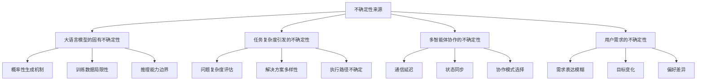
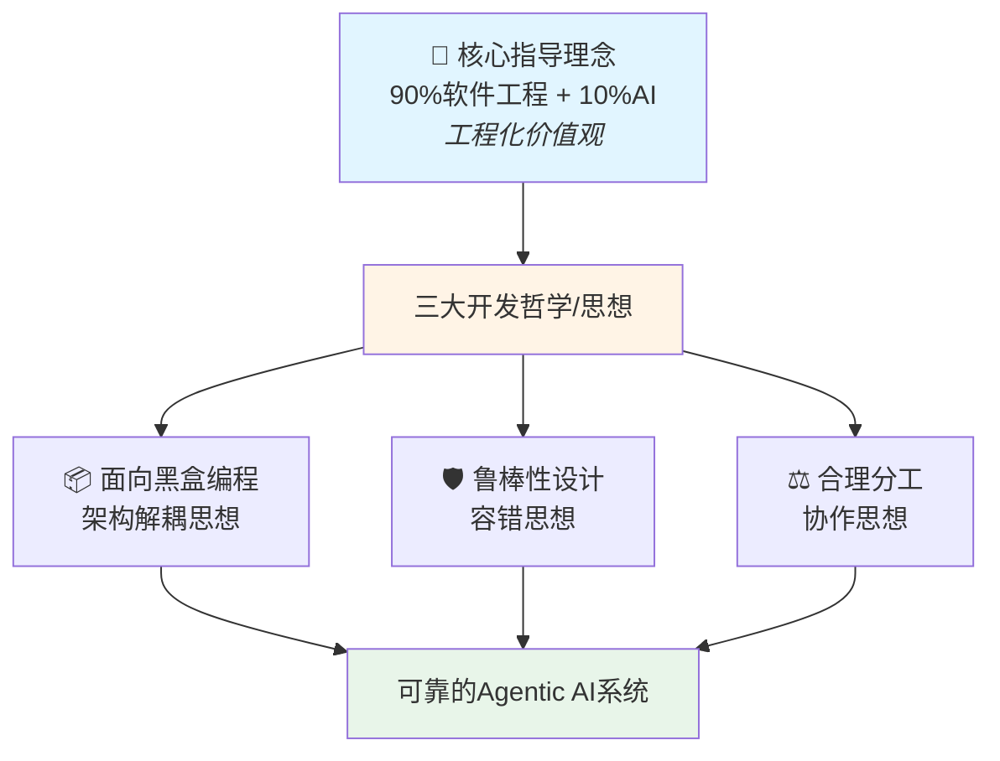
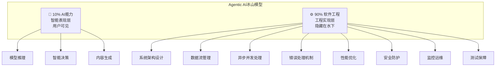
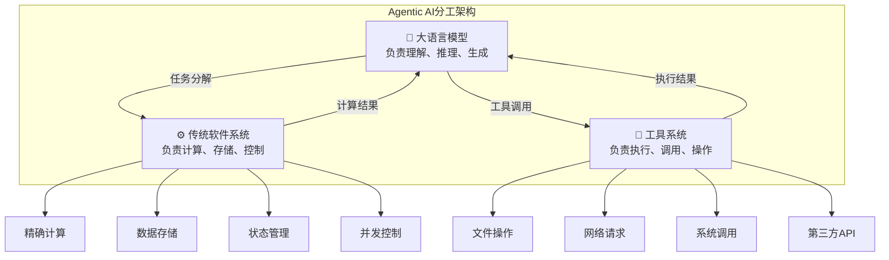
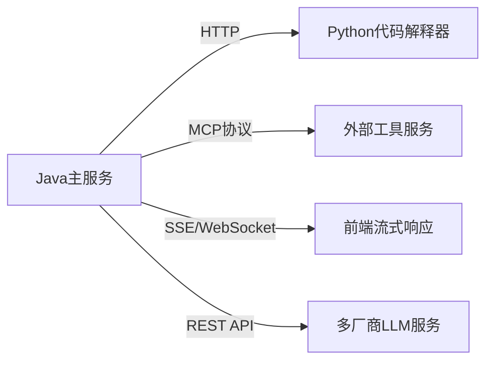
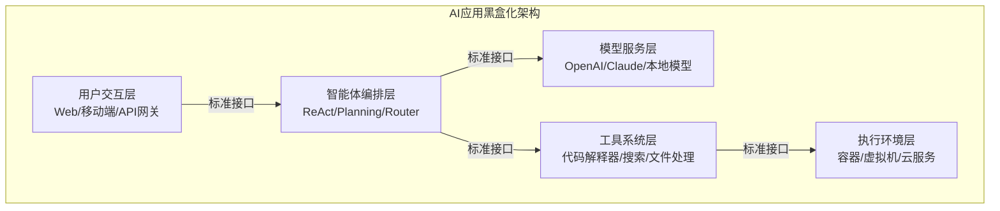
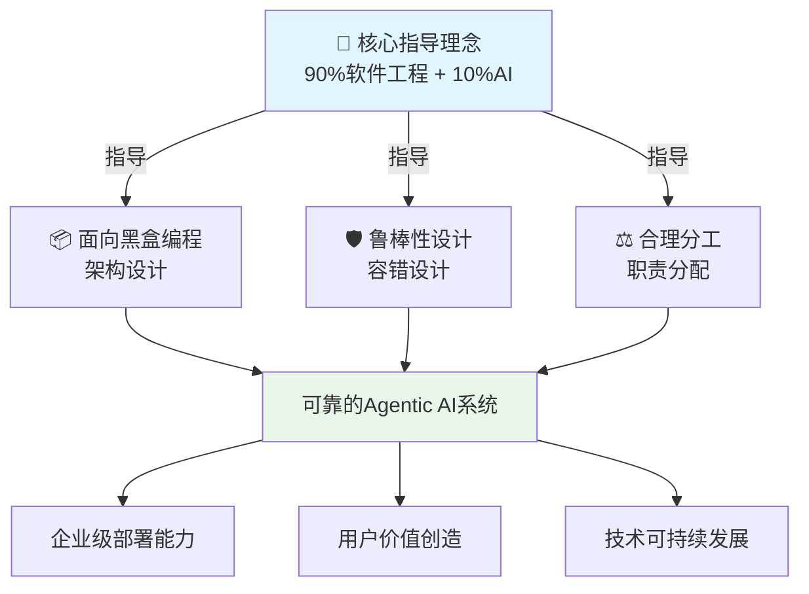

# 0.2 为什么需要新的开发理念？

> **本章重点**：理解Agentic AI开发的核心指导理念和三大开发哲学，建立正确的开发思维模式

## 🎯 核心问题

既然我们已经理解了什么是Agentic AI，那么一个自然的问题就是：**为什么构建Agentic AI系统需要全新的开发理念？**传统的软件开发方法为什么不够用了？

本章将为您揭示Agentic AI开发面临的根本性挑战，以及应对这些挑战所需的理念体系：
- **一个核心指导理念**：明确价值观和方向
- **三大开发哲学**：提供方法论指引

---

## 🚨 传统开发方法的局限性

### 确定性 vs 不确定性

传统软件开发基于**确定性假设**：
- 输入是可预测的
- 处理逻辑是确定的  
- 输出是可控的

但Agentic AI系统面临**多重不确定性**：



### 单体架构 vs 分布式协作

传统应用通常采用**单体架构**，而Agentic AI需要**多智能体协作**，这带来了全新的挑战：
- 分布式状态管理
- 异步通信协调
- 故障传播控制
- 智能涌现管理

---

## 💡 核心指导理念与三大开发哲学

面对这些挑战，我们需要建立全新的开发理念体系：



### 理念体系说明

**层次一：核心指导理念**
- **90%软件工程 + 10%AI** - 这是最根本的价值观，强调工程化实践的重要性

**层次二：三大开发哲学**
- **面向黑盒编程** - 指导如何设计架构（架构设计哲学）
- **鲁棒性设计** - 指导如何应对不确定性（系统设计哲学）
- **合理分工** - 指导如何分配职责（职责分配哲学）

这些哲学是核心指导理念在具体开发实践中的方法论体现。

---

## 💼 核心指导理念："90%软件工程 + 10%AI"

> **理念定位**：这是Agentic AI开发的**根本价值观**，指导我们应该将重心放在哪里。它不是具体的方法论，而是一种态度和方向性的认知。

### 理念来源

### 冰山模型：隐藏的真相

随着应用规模的扩大和业务复杂度的提升，软件工程在整个开发过程中的重要性将愈发凸显。硅谷知名技术专家**Rakesh Gohel**在2025年8月提出了一个颠覆性的洞察：

> **核心洞察**
> 
> **"AI Agents are about 90% Software Engineering and only 10% AI"**
> 
> **"AI智能体，90%是软件工程，只有10%才是AI。"**

这就像一座冰山：


*图：Rakesh Gohel先生提出的AI Agents冰山模型*


基于对当前Agentic AI应用开发实践的深度观察和分析，我在Rakesh Gohel观点的基础上进一步提出：  
  
> **Agentic AI应用开发90%是软件工程，只有10%才是AI。**  
> 
> **Agentic AI Applications are about 90% Software Engineering and only 10% AI.**  
  

### 为什么是90%软件工程？

#### 🧊 冰山模型理解



用户看到的是AI的智能表现，但支撑这些表现的是大量的工程化实践。

#### 🔧 工程化实践的重要性

**系统可靠性**：
- Agentic AI系统需要7×24小时稳定运行
- 单个组件故障不能导致整个系统崩溃
- 需要完善的监控、告警和恢复机制

**性能要求**：
- 多智能体协作需要高效的通信机制
- 大规模并发处理需要优化的资源管理
- 流畅的用户体验需要流式响应与实时反馈机制

**安全保障**：
- 工具创造能力带来安全风险
- 需要完善的权限控制和沙箱隔离
- 多层次的安全防护机制

### 思维转换对比

| 传统AI思维 | Agentic AI工程思维 |
|-----------|---------------|
| 关注模型性能 | 关注系统可靠性 |
| 算法优化优先 | 架构设计优先 |
| 单点突破 | 系统性工程 |
| 实验室环境 | 生产环境 |
| 准确性导向 | 可用性导向 |

### 实践意义

#### 🏗️ 重视架构设计
- **分层架构**：清晰的职责分离
- **模块化设计**：组件的独立性和可替换性
- **接口标准化**：统一的通信协议

#### 📊 关注系统可靠性
- **监控体系**：实时监控、告警机制、性能分析
- **日志管理**：结构化日志、链路追踪、问题诊断
- **故障恢复**：自动恢复、手动介入、数据备份


---

## 🛡️ 开发哲学一：通过鲁棒性设计拥抱不确定性

> **哲学定位**：这是一种**系统设计哲学**，指导我们如何应对Agentic AI的不确定性特征。它是"90%软件工程"理念在容错设计方面的具体体现。

### 为什么要拥抱不确定性？

传统软件开发追求**确定性和可预测性**，但Agentic AI系统天然具有**不确定性**：

#### 🎲 大语言模型的概率性
- LLM基于概率分布生成内容
- 相同输入可能产生不同输出
- 推理过程存在不可预测性

#### 🔄 任务执行的动态性
- 复杂任务的分解路径多样
- 执行过程中环境可能变化
- 协作模式需要动态调整

#### 🌐 多智能体协作的复杂性
- 智能体间的交互难以完全预测
- 涌现行为无法事先设计
- 系统状态的同步存在延迟

### 如何拥抱不确定性？

**实践策略**：
- **多方案准备**：准备多个候选解决方案
- **动态选择**：根据实时情况选择最优方案

#### 🛡️ 容错设计
**韧性系统架构**：
- 系统能够承受部分组件失效
- 单点故障不会导致系统崩溃
- 具备自动恢复和降级能力

**优雅降级**：
- 在异常情况下提供有限但可用的服务
- 保证核心功能的可用性
- 给用户明确的状态反馈

#### 🔄 自适应机制
**动态调整**：
- 根据执行反馈调整策略
- 实时监控系统状态
- 自动优化资源分配

**学习优化**：
- 从历史经验中学习最佳实践
- 识别成功和失败的模式
- 持续改进决策质量

---

## ⚖️ 开发哲学二：不要指望大模型做所有事情-合理分工

> **哲学定位**：这是一种**职责分配哲学**，指导我们如何在大模型与传统软件系统之间合理分工。它是"90%软件工程"理念在系统职责设计方面的具体体现。

### 大模型的能力边界

#### ✅ 大模型的优势
- **语言理解与生成**：自然语言处理能力
- **知识推理**：基于训练数据的推理能力
- **创意生成**：创造性内容产生能力
- **模式识别**：复杂模式的识别能力

#### ❌ 大模型的局限
- **精确计算**：数值计算容易出错
- **实时数据**：无法获取最新信息
- **系统调用**：无法直接操作系统资源
- **状态管理**：缺乏持续的状态记忆

### 为什么需要合理分工？

#### 🎯 效率考虑
- 让每个组件做最擅长的事情
- 避免用大模型处理简单计算任务
- 优化整体系统性能

#### 💰 成本考虑
- 大模型调用成本较高
- 传统计算方法成本低
- 合理分工可以显著降低运营成本

#### 🛡️ 可靠性考虑
- 传统软件系统更加稳定可靠
- 减少对大模型的过度依赖
- 提高系统整体的鲁棒性

### 合理分工架构



### 实践原则

#### 🎯 职责分离
- **明确边界**：清晰定义各组件的职责范围
- **接口标准化**：通过标准接口进行交互
- **独立演进**：各组件可以独立优化升级

#### 🔧 优势互补
- **发挥所长**：让每个组件做最擅长的事情
- **弥补不足**：通过组合弥补单一组件的局限
- **协同增效**：实现"1+1>2"的协同效应

#### ⚖️ 平衡设计
- **智能性 vs 可靠性**：在智能程度和系统可靠性间找平衡
- **灵活性 vs 性能**：在系统灵活性和执行性能间找平衡
- **复杂性 vs 可维护性**：在功能复杂性和系统可维护性间找平衡

---

## 📦 开发哲学三：面向黑盒编程-接口优先与组件可替换

> **哲学定位**：这是一种**架构设计哲学**，指导我们如何构建灵活可扩展的系统架构。它是"90%软件工程"理念在架构设计方面的具体体现。

### 什么是面向黑盒编程？

面向黑盒编程（Black-Box Programming）是一种强调**通过接口抽象和封装，隐藏系统内部实现细节**的编程范式。在Agentic AI应用中，这种思想体现在将复杂的AI能力封装为标准化的接口服务，使系统组件间的交互仅通过明确定义的输入输出进行，而内部实现对外界完全隐藏。

#### 🎯 核心特征

**契约式编程**：
- 每个组件都遵循预定义的接口契约
- 只要契约不变，内部实现可以任意替换和优化
- 降低系统复杂性，增强组件的可重用性

**分层解耦**：
- 每一层都通过标准化接口与其他层交互
- 同层组件可以无缝替换而不影响其他层
- 资源隔离确保执行安全

### 为什么Agentic AI需要面向黑盒编程？

#### 🔄 应对不确定性

传统软件的接口背后是确定的行为，但AI应用中：
- **LLM输出不确定**：相同输入可能产生不同输出
- **智能体路径不可预测**：执行步骤数量不固定
- **工具执行结果多变**：可能成功、失败、超时

面向黑盒编程要求在**每一层**都做好：
- 容错机制
- 超时控制
- 降级策略
- 可观测性

#### 🌐 跨系统协作

AI应用需要**跨系统、跨语言、跨网络**的组件协作：



这不仅仅是一个`interface`，而是一套**协议体系**。

### 面向黑盒编程架构



### 思维转换对比

**传统OOP思维（实现优先）**：
```
需求 → 实现方案 → 编码实现 → 接口暴露
```

**面向黑盒思维（接口优先）**：
```
需求 → 接口设计 → 契约定义 → 多种实现 → 最优选择
```

### 在AI应用中的核心价值

#### 🔌 模型无关性

通过定义统一的LLM调用接口，应用可以轻松切换不同的语言模型，而无需修改业务逻辑代码：

```java
public interface LLMService {
    CompletableFuture<LLMResponse> generate(LLMRequest request);
    Stream<LLMToken> generateStream(LLMRequest request);
}

// 可替换的实现
public class OpenAIService implements LLMService { /* ... */ }
public class ClaudeService implements LLMService { /* ... */ }
public class LocalLLMService implements LLMService { /* ... */ }
```

**配置驱动切换**：
```yaml
llm:
  provider: "openai"  # 可切换为 "claude", "local" 等
  model: "gpt-4"
```

#### 🧩 能力组合性

每个AI能力（如代码生成、文档分析、搜索等）都可以封装为独立的黑盒服务，系统可以通过编排这些黑盒组件实现复杂的业务逻辑。

#### 🔧 技术栈灵活性

在多技术栈的AI应用环境中，面向黑盒编程允许不同技术栈的组件通过标准化接口协作：
- Python实现的机器学习服务 ↔ Java业务系统
- Node.js前端 ↔ Go语言后端服务
- 容器化工具服务 ↔ 云原生应用平台

### 实践原则

#### 📋 接口抽象原则
- 描述"做什么"而非"怎么做"
- 保持版本兼容性
- 具有明确的输入输出定义
- 包含完整的错误处理机制

#### 🎯 单一职责原则
- 每个黑盒组件只承担一个明确的职责
- 便于理解和测试
- 有利于组件的独立演进

#### 🔄 依赖倒置原则
- 高层模块不应该依赖低层模块
- 二者都应该依赖于抽象
- 确保系统的灵活性和可扩展性

#### 🔓 开放封闭原则
- 黑盒组件对扩展开放，对修改封闭
- 通过插件机制、配置驱动实现功能扩展
- 不修改现有代码

### 与传统OOP的区别

| 维度 | 面向对象编程 (OOP) | 面向黑盒编程 |
|------|-------------------|-------------|
| **核心关注点** | 对象建模——将现实世界实体抽象为类 | 组件交互——通过契约接口实现解耦 |
| **设计目标** | 代码复用、模拟现实世界 | 组件可替换、系统灵活性 |
| **主要场景** | 传统软件开发 | AI应用开发（高不确定性组件协作） |
| **设计优先级** | 实现优先 | 接口优先 |
| **核心原则** | 封装、继承、多态 | 契约式编程、依赖倒置、协议标准化 |

### 架构价值

#### 📉 降低系统复杂度
- 通过接口抽象，系统各部分关注点分离
- 开发者只需理解接口契约，无需了解具体实现
- 大大降低系统的认知复杂度

#### ⚡ 提升开发效率
- 团队成员可以并行开发不同的黑盒组件
- 只要接口契约确定，各组件可独立开发
- 提升整体开发效率

#### 🛠️ 增强系统可维护性
- 修改组件实现时，只要接口不变，其他组件无需修改
- 降低维护成本和风险
- 支持渐进式重构

#### 🚀 促进技术演进
- 为技术栈的更新和替换提供可能
- 新技术出现时可逐步替换单个组件
- 不影响整体系统稳定性

---

## 🔄 理念体系的协同作用

### 理念层次与关系



### 从理念到实践的映射

**核心指导理念的作用**：
- 建立正确的**价值观** → 重视工程化而非过度依赖AI能力
- 指导**资源分配** → 90%精力在工程实践，10%精力在AI调优
- 确定**评估标准** → 系统可靠性优先于AI智能度

**三大哲学的协同**：

1. **面向黑盒编程 × 鲁棒性设计**
   - 黑盒封装隔离故障传播范围
   - 鲁棒性设计确保每个黑盒的可靠性
   - 共同提升系统容错能力

2. **面向黑盒编程 × 合理分工**
   - 黑盒接口定义组件边界
   - 合理分工明确组件职责
   - 共同实现清晰的架构设计

3. **鲁棒性设计 × 合理分工**
   - 合理分工避免大模型承担不擅长的任务
   - 鲁棒性设计应对各组件的不确定性
   - 共同优化系统性能和稳定性


---

## 🎯 理念理解检查

### 自我评估

1. **层次理解**：能够区分核心指导理念和三大开发哲学的层次关系？
2. **理念把握**：能够用自己的话解释"90%软件工程"的价值观？
3. **哲学应用**：能够在实际场景中运用三大开发哲学？
4. **思维转换**：从传统AI开发思维转向Agentic AI工程思维？

### 理解程度检查
- [ ] **基础认知**：理解核心指导理念的基本含义
- [ ] **层次把握**：明确核心理念与三大哲学的关系
- [ ] **深度理解**：掌握每个哲学背后的设计思想
- [ ] **实践转化**：能够将理念和哲学转化为具体实践
- [ ] **综合运用**：能够综合运用整个理念体系指导开发

---

## 📖 延伸阅读指引

### 下一步学习路径

理解了"为什么需要新的开发理念"后，您可能会思考：**如何将这个理念体系转化为具体的系统架构？**

在下一章中，我们将深入探讨：
- **🏗️ 五层架构设计**：如何构建支持智能涌现的系统架构？
- **🔄 层间协作机制**：各层如何协作产生系统级智能？
- **📊 架构质量评估**：如何评估架构设计的有效性？
- **💡 理念到架构的映射**：核心理念和三大哲学如何体现在架构中？

**📖 推荐阅读路径**：
- **架构师** → 重点关注下一章的架构设计原则和理念体系的架构映射
- **开发者** → 重点关注具体的技术实现方案和工程化实践
- **项目经理** → 重点关注架构对项目管理的影响和理念的团队落地

### 理念体系深化学习路径

**核心理念深化**：
- **工程化实践详解** → 第二部分：AI应用的开发基础
  - 流式通信、异步并发、状态机、设计模式等工程化技术

**三大哲学深化**：
- **面向黑盒编程哲学** → 第三部分 3.1：面向黑盒编程
- **鲁棒性设计哲学** → 第三部分 3.2：鲁棒性设计  
- **合理分工哲学** → 第三部分 3.3：合理分工

### 理念实践顺序建议

对于初学者，建议按以下顺序理解和实践整个理念体系：

1. **首先内化核心理念** → 建立"90%软件工程"的价值观和工程化思维基础
2. **然后学习架构哲学** → 掌握"面向黑盒编程"的架构设计方法
3. **接着应用分工哲学** → 运用"合理分工"优化系统性能和成本
4. **最后实践容错哲学** → 通过"鲁棒性设计"提升系统可靠性

---

> **💡 理念内化建议**：这个理念体系不仅是技术指导，更是思维模式的根本转换。核心指导理念确立价值观方向，三大开发哲学提供方法论指引。建议在每个开发决策中都回顾这个体系，逐步内化为开发习惯。特别要注意：不是先学AI再学工程，而是始终以工程化思维为主导，将AI能力作为系统的一个组成部分。
