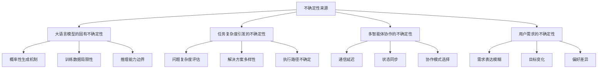
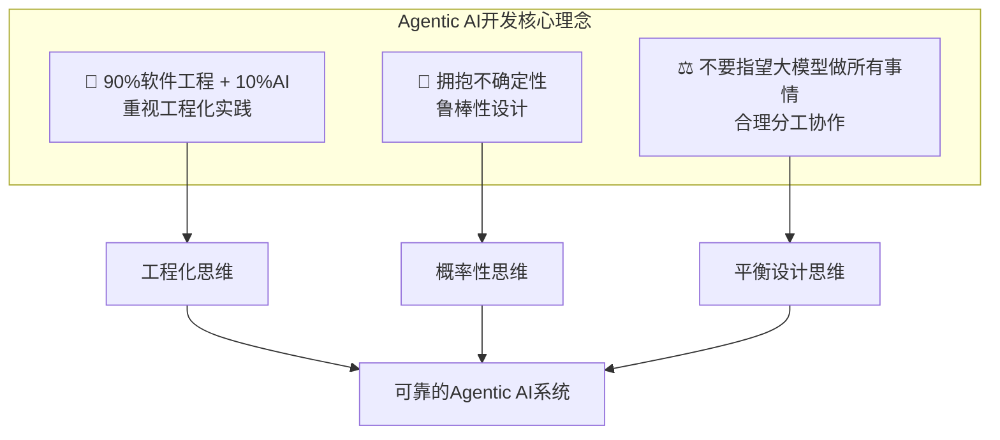
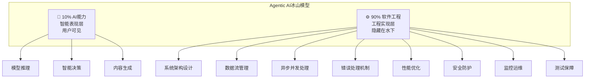
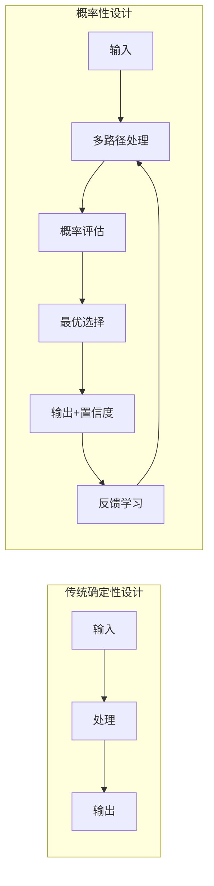
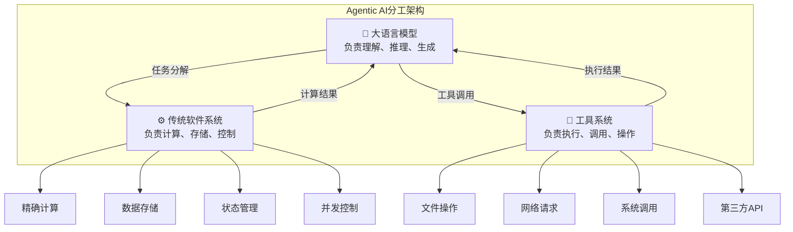
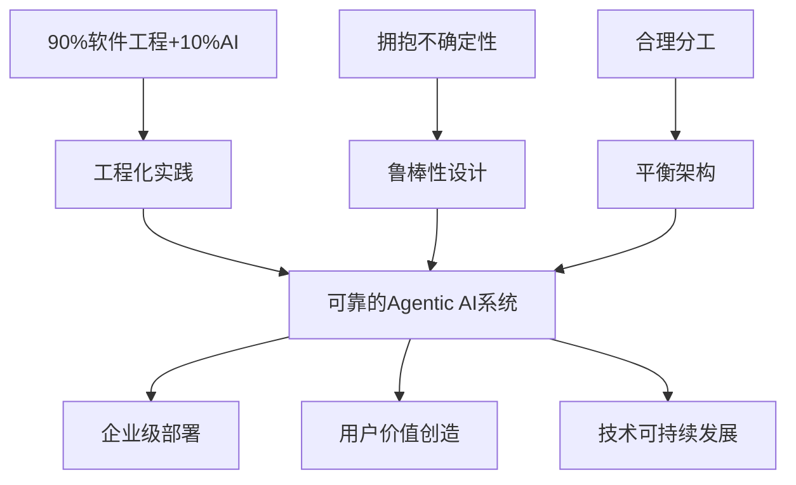

# 0.2 为什么需要新的开发理念？

> **本章重点**：理解Agentic AI开发的三大核心理念，建立正确的开发思维模式

## 🎯 核心问题

既然我们已经理解了什么是Agentic AI，那么一个自然的问题就是：**为什么构建Agentic AI系统需要全新的开发理念？**传统的软件开发方法为什么不够用了？

本章将为您揭示Agentic AI开发面临的根本性挑战，以及应对这些挑战所需的三大核心理念。

---

## 🚨 传统开发方法的局限性

### 确定性 vs 不确定性

传统软件开发基于**确定性假设**：
- 输入是可预测的
- 处理逻辑是确定的  
- 输出是可控的

但Agentic AI系统面临**多重不确定性**：

### 单体架构 vs 分布式协作

传统应用通常采用**单体架构**，而Agentic AI需要**多智能体协作**，这带来了全新的挑战：
- 分布式状态管理
- 异步通信协调
- 故障传播控制
- 智能涌现管理

---

## 💡 三大核心理念

面对这些挑战，我们需要建立全新的开发理念：

---

## 💼 理念一："90%软件工程 + 10%AI"

### 理念来源

### 冰山模型：隐藏的真相

随着应用规模的扩大和业务复杂度的提升，软件工程在整个开发过程中的重要性将愈发凸显。硅谷知名技术专家**Rakesh Gohel**在2025年8月提出了一个颠覆性的洞察：

> **核心洞察**
> 
> **"AI Agents are about 90% Software Engineering and only 10% AI"**
> 
> **"AI智能体，90%是软件工程，只有10%才是AI。"**

这就像一座冰山：

*图：Rakesh Gohel先生提出的AI Agents冰山模型*

基于对当前Agentic AI应用开发实践的深度观察和分析，我在Rakesh Gohel观点的基础上进一步提出：  
  
> **Agentic AI应用开发90%是软件工程，只有10%才是AI。**  
> 
> **Agentic AI Applications are about 90% Software Engineering and only 10% AI.**  
  

### 为什么是90%软件工程？

#### 🧊 冰山模型理解

用户看到的是AI的智能表现，但支撑这些表现的是大量的工程化实践。

#### 🔧 工程化实践的重要性

**系统可靠性**：
- Agentic AI系统需要7×24小时稳定运行
- 单个组件故障不能导致整个系统崩溃
- 需要完善的监控、告警和恢复机制

**性能要求**：
- 多智能体协作需要高效的通信机制
- 大规模并发处理需要优化的资源管理
- 流畅的用户体验需要流式响应与实时反馈机制

**安全保障**：
- 工具创造能力带来安全风险
- 需要完善的权限控制和沙箱隔离
- 多层次的安全防护机制

### 思维转换对比

| 传统AI思维 | Agentic AI工程思维 |
|-----------|---------------|
| 关注模型性能 | 关注系统可靠性 |
| 算法优化优先 | 架构设计优先 |
| 单点突破 | 系统性工程 |
| 实验室环境 | 生产环境 |
| 准确性导向 | 可用性导向 |

### 实践意义

#### 🏗️ 重视架构设计
- **分层架构**：清晰的职责分离
- **模块化设计**：组件的独立性和可替换性
- **接口标准化**：统一的通信协议

#### 📊 关注系统可靠性
- **监控体系**：实时监控、告警机制、性能分析
- **日志管理**：结构化日志、链路追踪、问题诊断
- **故障恢复**：自动恢复、手动介入、数据备份

---

## 🤝 理念二：通过鲁棒性设计拥抱不确定性

### 为什么要拥抱不确定性？

传统软件开发追求**确定性和可预测性**，但Agentic AI系统天然具有**不确定性**：

#### 🎲 大语言模型的概率性
- LLM基于概率分布生成内容
- 相同输入可能产生不同输出
- 推理过程存在不可预测性

#### 🔄 任务执行的动态性
- 复杂任务的分解路径多样
- 执行过程中环境可能变化
- 协作模式需要动态调整

#### 🌐 多智能体协作的复杂性
- 智能体间的交互难以完全预测
- 涌现行为无法事先设计
- 系统状态的同步存在延迟

### 如何拥抱不确定性？

#### 🎯 概率性思维
**从确定性到概率性**：

**实践策略**：
- **多方案准备**：准备多个候选解决方案
- **动态选择**：根据实时情况选择最优方案

#### 🛡️ 容错设计
**韧性系统架构**：
- 系统能够承受部分组件失效
- 单点故障不会导致系统崩溃
- 具备自动恢复和降级能力

**优雅降级**：
- 在异常情况下提供有限但可用的服务
- 保证核心功能的可用性
- 给用户明确的状态反馈

#### 🔄 自适应机制
**动态调整**：
- 根据执行反馈调整策略
- 实时监控系统状态
- 自动优化资源分配

**学习优化**：
- 从历史经验中学习最佳实践
- 识别成功和失败的模式
- 持续改进决策质量

---

## ⚖️ 理念三：不要指望大模型做所有事情-合理分工

### 大模型的能力边界

#### ✅ 大模型的优势
- **语言理解与生成**：自然语言处理能力
- **知识推理**：基于训练数据的推理能力
- **创意生成**：创造性内容产生能力
- **模式识别**：复杂模式的识别能力

#### ❌ 大模型的局限
- **精确计算**：数值计算容易出错
- **实时数据**：无法获取最新信息
- **系统调用**：无法直接操作系统资源
- **状态管理**：缺乏持续的状态记忆

### 为什么需要合理分工？

#### 🎯 效率考虑
- 让每个组件做最擅长的事情
- 避免用大模型处理简单计算任务
- 优化整体系统性能

#### 💰 成本考虑
- 大模型调用成本较高
- 传统计算方法成本低
- 合理分工可以显著降低运营成本

#### 🛡️ 可靠性考虑
- 传统软件系统更加稳定可靠
- 减少对大模型的过度依赖
- 提高系统整体的鲁棒性

### 合理分工架构

### 实践原则

#### 🎯 职责分离
- **明确边界**：清晰定义各组件的职责范围
- **接口标准化**：通过标准接口进行交互
- **独立演进**：各组件可以独立优化升级

#### 🔧 优势互补
- **发挥所长**：让每个组件做最擅长的事情
- **弥补不足**：通过组合弥补单一组件的局限
- **协同增效**：实现"1+1>2"的协同效应

#### ⚖️ 平衡设计
- **智能性 vs 可靠性**：在智能程度和系统可靠性间找平衡
- **灵活性 vs 性能**：在系统灵活性和执行性能间找平衡
- **复杂性 vs 可维护性**：在功能复杂性和系统可维护性间找平衡

---

## 🔄 三大理念的协同作用

### 理念间的关系

---

## 🎯 理念理解检查

### 自我评估

1. **理念理解**：能够用自己的话解释三大核心理念？
2. **思维转换**：从传统AI开发思维转向Agentic AI工程思维？
3. **实践应用**：能够在实际项目中应用这些理念？

### 理解程度检查
- [ ] **基础认知**：理解三大理念的基本含义
- [ ] **深度理解**：掌握理念背后的设计思想
- [ ] **实践转化**：能够将理念转化为具体实践
- [ ] **综合运用**：能够综合运用三大理念指导开发

---

## 📖 延伸阅读指引

### 下一步学习路径

理解了"为什么需要新的开发理念"后，您可能会思考：**如何将这些理念转化为具体的系统架构？**

在下一章中，我们将深入探讨：
- **🏗️ 五层架构设计**：如何构建支持智能涌现的系统架构？
- **🔄 层间协作机制**：各层如何协作产生系统级智能？
- **📊 架构质量评估**：如何评估架构设计的有效性？

**📖 推荐阅读路径**：
- **架构师** → 重点关注下一章的架构设计原则
- **开发者** → 重点关注具体的技术实现方案
- **项目经理** → 重点关注架构对项目管理的影响

### 理念深化学习路径

- **工程实践详解** → 第二部分：AI应用的开发基础
- **不确定性处理** → 第三部分：鲁棒性设计
- **合理分工实践** → 第三部分：合理分工

---

> **💡 理念内化建议**：这三大理念不仅是技术指导，更是思维模式的转换。建议在每个开发决策中都回顾这些理念，逐步内化为开发习惯。
