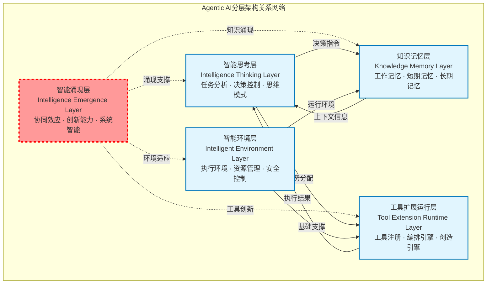
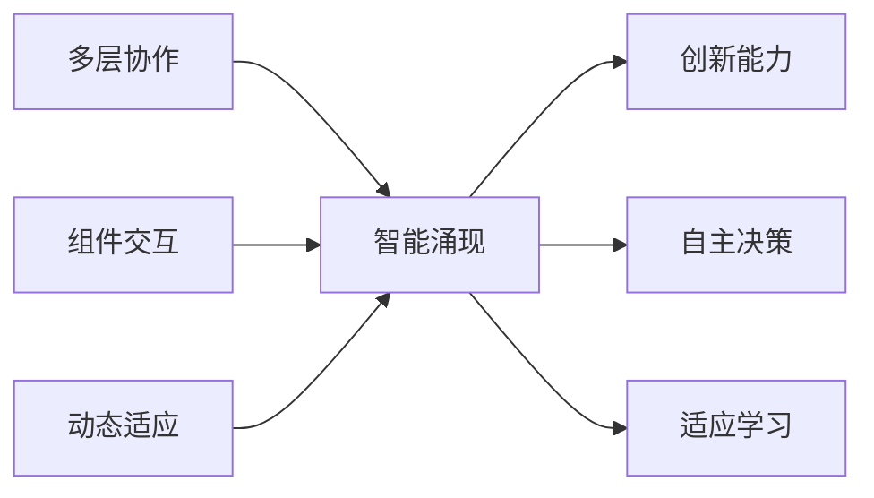
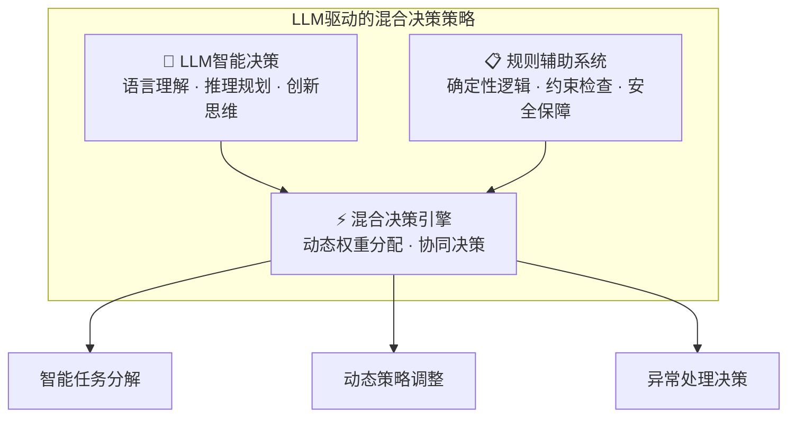
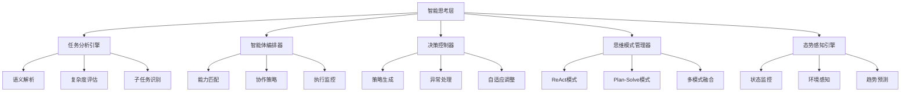
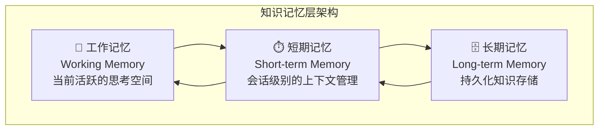
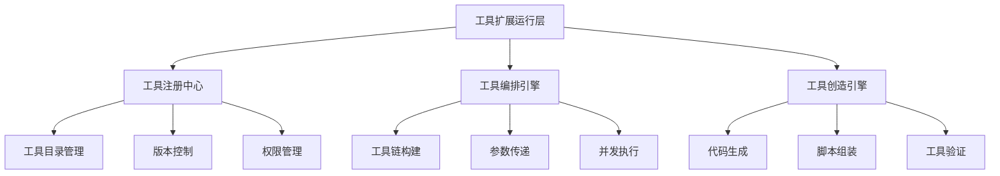
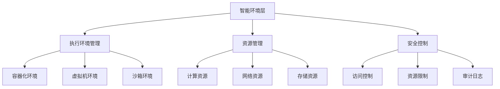
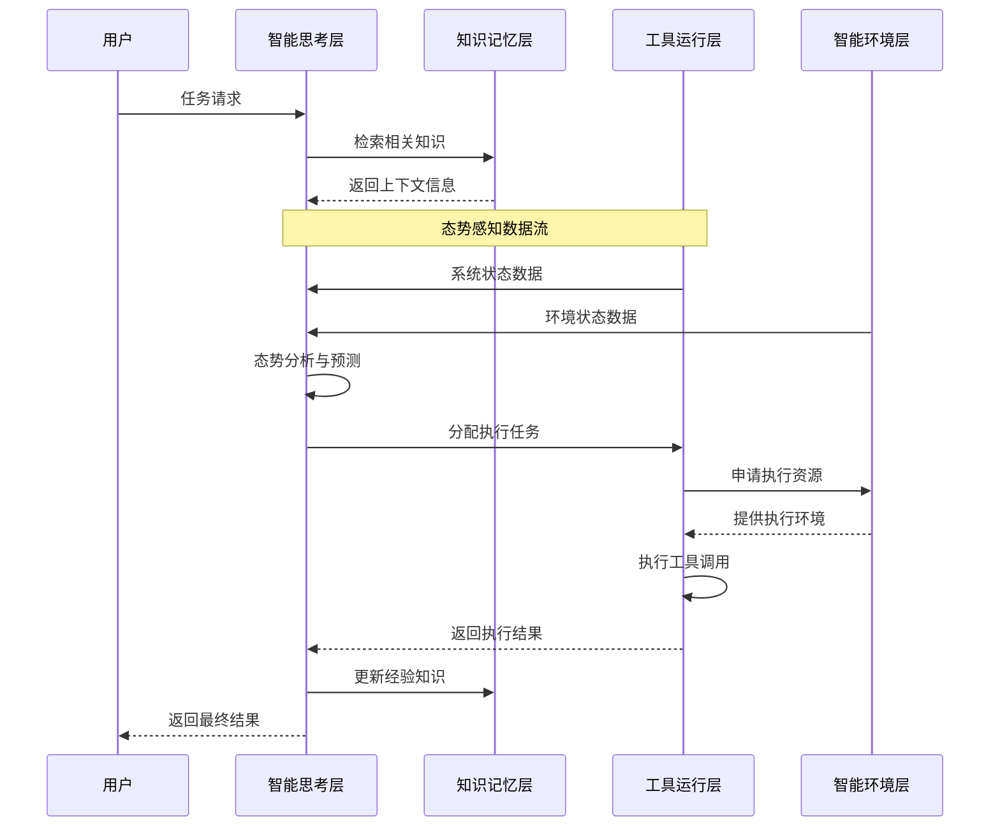
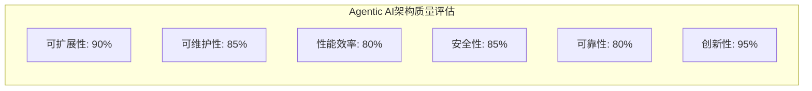

# 0.3 如何构建Agentic AI应用系统？

> **本章重点**：理解Agentic AI的五层架构设计，掌握各层的职责分工和协作关系

## 🎯 核心问题

理解了Agentic AI的概念和开发理念后，一个关键问题是：**如何将这些理念转化为具体的系统架构？**

本章将为您详细介绍Agentic AI的五层架构设计，这是构建智能涌现系统的核心框架。

---

## 🏗️ 架构总览

Agentic AI采用分层架构设计，每层承担特定职责并相互协作，形成智能涌现的基础。

### 📊 五层架构全景图

下图展示了目前在很多类似京东的多智能体项目joyagent-jdgenie已经实现的Agentic AI的完整技术架构：

### 📊 架构关系图谱

---

## 📋 各层详细说明

### 🎨 第一层：智能涌现层（Intelligence Emergence Layer）

#### 什么是智能涌现层？

**智能涌现层**是Agentic AI架构中的一个概念性抽象层，它不以具体软件组件的形式存在于代码实现中，而是通过多层协作产生的系统性智能现象层。

#### 核心特征

- **类型**：概念性抽象层
- **存在形式**：系统整体行为的抽象表现
- **核心作用**：体现"1+1>2"的协同效应

#### 涌现现象表现

#### 关键特征
- ✨ **非预设性**：产生设计时未预期的智能行为
- 🚀 **创新驱动**：系统创造性和自主性的体现  
- 🔄 **动态演化**：随系统运行不断演化

> **💡 核心要点**：智能涌现层不对应具体代码模块，而是通过多层协作产生的系统性智能现象层。

---

### 🧠 第二层：智能思考层（Intelligence Thinking Layer）

#### 核心定位

作为系统的**智能决策中心**，基于大语言模型驱动，形成LLM智能决策与规则辅助的混合策略，负责决策控制、状态管理、任务执行控制等核心逻辑。

#### 为什么需要智能思考层？

在传统软件系统中，决策逻辑通常是预先编程的规则。但在Agentic AI系统中，我们需要：

- **动态理解**：理解复杂、模糊的用户需求
- **智能规划**：制定灵活的执行策略
- **实时调整**：根据执行情况动态调整方案
- **协调管理**：统一协调各个组件的协作

#### 混合策略架构

#### 主要职责

1. **任务理解与分析**：解析用户需求，评估任务复杂度
2. **推理规划**：制定执行策略和步骤规划
3. **执行控制**：协调其他层次的协作执行
4. **反思优化**：评估执行结果，优化后续策略
5. **态势感知**：实时监控和分析系统内外环境状态

#### 核心组件

---

### 💭 第三层：知识记忆层（Knowledge Memory Layer）

#### 核心定位

构建和管理应用的**全生命周期知识体系**，提供类人记忆能力。

#### 为什么需要知识记忆层？

人类智能的一个重要特征是**记忆能力**：
- **工作记忆**：当前正在思考的内容
- **短期记忆**：最近的经历和学习
- **长期记忆**：积累的知识和经验

Agentic AI系统也需要类似的记忆机制来：
- 保持上下文连贯性
- 积累经验和知识
- 支持学习和改进

#### 分层记忆架构

#### 各层记忆的作用

**工作记忆（Working Memory）**：
- 存储当前任务的相关信息
- 支持实时推理和决策
- 容量有限，需要动态管理

**短期记忆（Short-term Memory）**：
- 存储会话级别的上下文
- 支持多轮对话的连贯性
- 包含最近的交互历史

**长期记忆（Long-term Memory）**：
- 存储持久化的知识和经验
- 支持跨会话的学习和改进
- 包含领域知识和最佳实践

#### 核心能力
- **动态上下文构建**：根据任务需求组装相关信息
- **语义检索**：基于语义相似度的智能检索
- **知识关联推理**：通过知识图谱实现概念关联
- **记忆管理**：智能遗忘和知识更新机制

---

### 🔧 第四层：工具扩展运行层（Tool Extension Runtime Layer）

#### 核心定位

Agentic AI的**核心执行层**，负责集成、管理和运行所有工具型资源。

#### 为什么需要工具扩展运行层？

Agentic AI的一个关键特征是**工具创造能力**。这需要：
- **工具管理**：统一管理各种工具资源
- **动态组合**：根据需求组合不同工具
- **创造新工具**：生成满足特定需求的新工具
- **安全执行**：确保工具执行的安全性

#### 主要组件

#### 核心特性
- **资源集成性**：统一管理所有工具资源
- **动态扩展性**：支持工具的动态添加和组合
- **智能编排性**：根据需求自动选择和组合工具
- **创造涌现性**：能够创造超越现有工具的新能力
- **状态感知性**：为态势感知提供系统状态数据支持

#### 工具类型示例

**基础工具**：
- 文件操作工具
- 网络请求工具
- 数据处理工具
- 计算工具

**复合工具**：
- 数据分析工具链
- 自动化测试工具链
- 部署发布工具链

**动态生成工具**：
- 根据需求生成的专用脚本
- 临时组合的工具链
- 自适应的处理流程

---

### 🐳 第五层：智能环境层（Intelligent Environment Layer）

#### 核心定位

为Agentic AI提供**运行支撑的基础设施层**，构建安全、高效、可扩展的执行环境。

#### 为什么需要智能环境层？

Agentic AI系统的工具创造和执行能力带来了新的挑战：
- **安全隔离**：防止恶意代码影响系统
- **资源管理**：合理分配和管理系统资源
- **环境适配**：支持不同类型的执行环境
- **监控治理**：全面监控系统运行状态

#### 主要组件

#### 核心能力
- **环境隔离**：提供安全的执行环境
- **资源调度**：智能分配和管理系统资源
- **安全保障**：多层次的安全控制机制
- **监控治理**：全面的系统监控和治理能力

#### 环境类型

**容器化环境**：
- Docker容器隔离
- Kubernetes编排管理
- 轻量级、快速启动

**虚拟机环境**：
- 完整的操作系统隔离
- 更强的安全性
- 支持复杂的系统级操作

**沙箱环境**：
- 受限的执行环境
- 防止恶意操作
- 适合不可信代码执行

---

## 🔄 层间协作关系

### 信息流向图

### 协作原则

1. **自下而上支撑**：每层为上层提供基础能力
2. **双向信息流动**：支持反馈和优化循环
3. **松耦合设计**：层间通过标准接口交互
4. **智能协调**：通过智能思考层统一协调

### 典型协作场景

#### 场景一：复杂任务执行

1. **用户请求**：用户提出复杂任务需求
2. **智能分析**：智能思考层分析任务，制定策略
3. **知识检索**：从知识记忆层获取相关经验
4. **工具编排**：工具运行层组合相应工具
5. **环境准备**：智能环境层提供执行环境
6. **协作执行**：各层协作完成任务
7. **经验积累**：将执行结果存入知识记忆层

#### 场景二：异常处理

1. **异常检测**：工具运行层检测到执行异常
2. **状态上报**：向智能思考层报告异常状态
3. **策略调整**：智能思考层制定应对策略
4. **资源调配**：智能环境层调配备用资源
5. **恢复执行**：系统自动恢复正常执行

---

## 🎯 架构设计原则

### 核心设计原则

#### 1. 分离关注点
- 每层专注于特定的职责领域
- 避免职责重叠和功能冗余
- 支持独立的优化和升级

#### 2. 接口标准化
- 定义清晰的层间接口规范
- 支持不同实现的可替换性
- 保证系统的可扩展性

#### 3. 智能协调
- 通过智能思考层统一决策
- 支持动态的资源分配
- 实现自适应的系统行为

#### 4. 涌现友好
- 为智能涌现现象提供基础
- 支持系统的创新和进化
- 鼓励跨层的协作创新

### 架构质量评估

#### 关键指标
- **响应时间**：系统对用户请求的响应速度
- **吞吐量**：单位时间内处理的任务数量
- **可用性**：系统正常运行的时间比例
- **扩展性**：支持负载增长的能力
- **创新度**：产生新能力的频率和质量

#### 评估维度

---

## 🛠️ 实现考虑

### 技术选型建议

#### 智能思考层
- **大语言模型**：GPT-4、Claude、或开源模型
- **推理框架**：LangChain、LlamaIndex等
- **状态管理**：Redis、数据库等

#### 知识记忆层
- **向量数据库**：Pinecone、Weaviate、Chroma等
- **图数据库**：Neo4j、ArangoDB等
- **缓存系统**：Redis、Memcached等

#### 工具扩展运行层
- **容器技术**：Docker、Podman等
- **编排系统**：Kubernetes、Docker Swarm等

#### 智能环境层 
- **Python解释器环境**：conda,pyenv等

---

## 📖 延伸阅读指引

### 下一步学习路径

理解了"如何构建Agentic AI系统"后，您可能希望深入了解：**这些架构设计背后的理论基础是什么？**

在下一章中，我们将深入探讨：
- **🧠 复杂适应系统理论**：智能涌现的理论基础
- **🔧 工具使用理论**：工具创造能力的认知科学基础
- **📚 最新研究进展**：学术界的前沿研究成果

**📖 推荐阅读路径**：
- **实践导向读者** → 可以跳过理论章节，直接进入第二部分技术实现
- **理论研究者** → 重点关注下一章的理论基础
- **架构师** → 建议完整阅读，理论与实践并重

### 技术深入学习

- **智能思考层实现** → 第四部分 4.2：智能思考工程
- **知识记忆层实现** → 第四部分 4.1：知识记忆层与上下文工程
- **工具运行层实现** → 第四部分 4.3：工具扩展运行层
- **智能环境层实现** → 第四部分 4.4：智能环境层

---

> **💡 架构理解要点**：分层架构不仅是技术实现的框架，更是理解Agentic AI本质的思维工具。每一层都承载着特定的智能功能，协作产生系统级的智能涌现。
