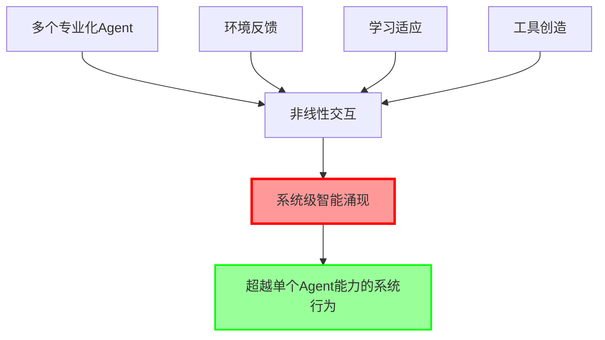

# 0.4 深入理解：理论基础与前沿发展

> **本章重点**：深入探讨Agentic AI的理论基础，了解学术研究前沿和未来发展趋势

## 🎯 章节定位

本章面向希望深入理解Agentic AI理论基础的读者，包括：
- 研究人员和学者
- 技术架构师
- 对理论基础感兴趣的开发者

如果您更关注实践应用，可以跳过本章，直接进入第一部分的技术实现内容。

---

## 🧠 理论基础体系

Agentic AI的兴起并非偶然，它建立在深厚的理论基础之上。理解这些理论，有助于我们更深刻地把握Agentic AI的本质，并在实践中做出更明智的设计决策。

本章将从以下几个维度深入探讨：

1. **工具智能理论**：理解从"静态知识"到"动态行为"的质变
2. **复杂适应系统理论**：掌握智能涌现的机制原理
3. **认知科学基础**：理解智能体的认知架构
4. **行为主义与强化学习**：探索智能体的学习机制
5. **学术研究前沿**：了解当前研究热点和发展趋势

---

## 1. 工具智能理论：从"静态知识"到"动态行为"的质变

工具的使用历来被视为区分人类与其他物种的关键标志，也是智能的根本体现。人类智能的核心特征，在于我们不仅能够使用工具，更能够创造工具来扩展自身能力。

### 传统AI与Agentic AI的本质差异

在AI发展的历程中，我们可以清晰地观察到从"静态知识"到"动态行为"的转变。传统AI系统例如推荐系统等，主要扮演"知识库"或"信息处理者"的角色：

**传统AI的特征**：
- **功能定位**：回答问题、生成文本、分析数据，其输出本质上是信息
- **行为模式**：被动响应式交互，遵循"输入-处理-输出"的线性流程
- **智能边界**：虽然可能在认知层面展现出超越人类的知识广度和推理速度，但其能力被限制在信息处理领域，无法直接作用于真实世界

而具备工具使用和创造能力的Agentic AI系统，则实现了向"执行者"和"工具创造者"的转变：

**Agentic AI的特征**：
- **功能定位**：不仅理解"是什么"，更能执行"怎么做"。系统可以调用API、操作软件、分析数据并直接执行操作，甚至能够动态生成新的代码工具来解决新问题。
- **行为模式**：主动规划式执行，能够将复杂目标分解为可执行的步骤序列。
- **智能边界**：在行为层面通过与真实世界的交互（即使是数字环境）来完成任务，其输出是行动的结果而非仅仅是信息。这使得智能从"认知"延伸到了"行动"，实现了从思考到执行的质变。

**工具创造的三个层次**：
1. **工具组合层**：创新性地组合现有工具
   - 通过组合不同工具的功能，实现单一工具无法完成的任务
   - 例如：结合搜索工具、分析工具和生成工具完成研究报告
   
2. **工具生成层**：根据需求动态生成新工具
   - 当现有工具无法满足需求时，系统能够生成新的工具代码
   - 例如：为特定数据分析任务生成定制化的Python脚本
   
3. **工具进化层**：通过反馈持续优化工具
   - 根据使用反馈不断改进工具的性能和功能
   - 例如：根据执行结果优化工具的参数和逻辑

### 工具智能的哲学意义

工具智能理论不仅是一种技术理论，更是一种哲学思考。它揭示了智能的本质特征：

1. **智能的扩展性**：智能不是固定的能力，而是可以通过工具不断扩展
2. **智能的创造性**：真正的智能不仅在于使用工具，更在于创造工具
3. **智能的行动性**：智能不仅体现在思考，更体现在行动和改变世界

这些特征使得Agentic AI系统具备了向更高层次智能发展的潜力。

---

## 2. 复杂适应系统理论与智能涌现

Agentic AI系统的核心特征在于其能够产生"智能涌现"——系统整体智能超越各组成部分简单叠加的现象。这一现象的理论基础来自复杂适应系统理论和涌现理论。

### 2.1 复杂适应系统理论（Complex Adaptive Systems Theory）

#### 理论来源与发展
- **Santa Fe Institute**：20世纪80年代成立的复杂性科学研究重镇
- **核心观点**：复杂系统的整体行为往往超越其组成部分的简单叠加，表现出"涌现"特性
- **数学表述**：系统整体功能 ≠ Σ(各组件功能)，即存在非线性交互效应

#### 复杂适应系统的关键特征

1. **自组织性**：系统能够自主调整结构和功能
2. **适应性**：能够根据环境变化动态调整行为
3. **非线性**：小的输入变化可能产生巨大的系统响应
4. **层次性**：系统由多个层次组成，每个层次都有其独特的涌现特性

#### 在Agentic AI中的应用



**关键洞察**：
- Agentic AI系统的智能不是各个Agent智能的简单相加
- 系统级的智能涌现是设计目标，而非意外产物
- 需要特殊的架构设计来促进和管理涌现现象
- 涌现的质量取决于Agent间的交互模式和协作机制

### 2.2 涌现理论（Emergence Theory）

#### 理论奠基
- **理论奠基人**：Philip Anderson（诺贝尔物理学奖得主，1977年）在经典论文《More is Different》中提出
- **核心原理**：当系统达到一定复杂度时，会自发产生新的性质和行为模式
- **关键特征**：非线性、自组织、层次性、适应性、不可预测性

#### 涌现的数学模型

**弱涌现（Weak Emergence）**：
```
E(系统) = f(组件₁, 组件₂, ..., 组件ₙ, 交互关系)
```
其中 `f` 是非线性函数，系统行为可以从组件行为推导出来，但需要复杂的计算。在Agentic AI中，这表现为通过精心设计的架构，可以预期系统会产生某些智能行为。

**强涌现（Strong Emergence）**：
```
E(系统) ≠ f(组件₁, 组件₂, ..., 组件ₙ, 交互关系)
```
系统产生了完全新的、不可从组件行为预测的特性。这是Agentic AI系统追求的理想状态——产生设计时未预期的创新性解决方案。

#### 在Agentic AI中的体现

**智能涌现的层次**：

1. **功能涌现**：系统获得单个Agent不具备的功能
   - 例如：单个Agent无法完成的任务，通过多Agent协作得以实现
   
2. **创新涌现**：系统产生创新性的解决方案
   - 例如：通过工具组合和创造，产生新的问题解决方法
   
3. **适应涌现**：系统获得自适应和自优化能力
   - 例如：系统能够根据任务特点动态调整Agent配置和协作模式

4. **学习涌现**：系统整体获得超越单个Agent的学习能力
   - 例如：通过经验共享和知识传递，系统整体性能持续提升

#### 促进智能涌现的设计原则

1. **多样性原则**：确保Agent具有不同的专业能力和视角
   - **为什么重要**：只有多样化的Agent才能产生互补效应，单一类型的Agent无法产生真正的涌现
   - **实践示例**：在一个数据分析系统中，同时包含数据收集Agent、分析Agent、可视化Agent和报告生成Agent

2. **交互原则**：设计丰富的交互机制，促进Agent间的信息交换
   - **核心理解**：智能涌现不是单个Agent能力的简单叠加，而是Agent间通过交互产生的协同效应。就像人类团队协作一样，团队成员之间的有效沟通和协作是产生"1+1>2"效果的关键。
   - **"丰富的交互机制"包括**：
     - **直接通信**：Agent之间可以直接传递消息、共享上下文信息
     - **共享状态**：通过共享状态空间让Agent了解系统整体情况
     - **事件驱动**：Agent可以订阅和发布事件，实现异步协作
     - **工具共享**：Agent可以共享工具和资源，避免重复工作
     - **知识传递**：Agent可以将学到的知识传递给其他Agent
   - **实践示例**：
     - 在一个多Agent写作系统中，研究Agent将收集的资料传递给写作Agent，写作Agent将初稿传递给编辑Agent，编辑Agent将修改建议反馈给写作Agent，形成协作循环
     - 在AutoGen框架中，Agent可以通过对话机制进行多轮交互，每个Agent可以基于前一个Agent的输出进行进一步处理


3. **反馈原则**：建立有效的反馈机制，让系统能够学习和适应
   - **为什么重要**：反馈是系统学习和改进的基础，没有反馈的系统无法进化
   - **实践示例**：Agent执行任务后获得结果反馈，根据反馈调整策略；

4. **层次原则**：构建多层次的架构，允许不同层次的涌现
   - **为什么重要**：不同层次可以产生不同类型的涌现，层次化的设计让系统更加灵活和强大
   - **实践示例**：jdgenie 5层核心层

5. **开放性原则**：保持系统的开放性，允许新Agent和新工具的加入
   - **为什么重要**：开放的系统能够持续进化，封闭的系统会逐渐僵化
   - **实践示例**：系统提供插件机制，允许动态添加新的Agent和工具

---

## 3. 认知科学基础：理解智能体的认知架构

Agentic AI系统的设计深受认知科学的影响，特别是对人类认知过程的理解。理解这些认知科学基础，有助于我们设计更符合智能本质的Agentic AI系统。

### 3.1 工作记忆与长期记忆

#### 理论基础
- **工作记忆理论**：Baddeley & Hitch (1974) 提出的多组件工作记忆模型
- **核心观点**：工作记忆是认知活动的"工作台"，负责临时存储和处理信息
- **长期记忆**：存储持久性知识和经验的结构化知识库

#### 在Agentic AI中的映射

Agentic AI系统的记忆架构通常包括：

1. **工作记忆**：存储当前任务的上下文和中间状态
   - 对应：Agent的短期上下文窗口
   - 特点：容量有限、快速访问、易失性

2. **短期记忆**：存储会话级别的信息和状态
   - 对应：会话历史、任务执行状态
   - 特点：中等容量、结构化存储

3. **长期记忆**：存储持久性知识和经验
   - 对应：向量数据库、知识图谱、经验库
   - 特点：大容量、持久化、可检索

### 3.2 元认知与自我监控

#### 理论基础
- **元认知理论**：Flavell (1979) 提出的关于"认知的认知"的理论
- **核心观点**：智能体需要具备监控和控制自身认知过程的能力

#### 在Agentic AI中的体现

1. **任务规划监控**：Agent能够评估任务执行进度，调整策略
2. **能力边界认知**：Agent能够识别自身能力的局限，寻求帮助
3. **错误检测与纠正**：Agent能够识别错误并采取纠正措施
4. **学习策略调整**：Agent能够根据任务特点调整学习方法

### 3.3 分布式认知理论

#### 理论基础
- **分布式认知**：Hutchins (1995) 提出的认知不仅存在于个体内部，也分布在工具、环境和社会系统中
- **核心观点**：认知是系统性的，智能是分布式的

#### 在Agentic AI中的应用

Agentic AI系统体现了分布式认知的特点：

1. **工具扩展认知**：通过工具系统扩展Agent的认知能力
2. **多Agent协作**：认知任务分布在多个Agent之间
3. **环境交互**：通过与环境的交互获得认知反馈
4. **知识外化**：将知识存储在外部系统中，形成"外部记忆"

---


## 4 技术发展趋势

### 趋势一：从单一模型到模型生态

**现状**：当前主要依赖单一大型语言模型（如GPT-4、Claude等）

**趋势**：向多模型协作的生态转变
- **专业化模型**：针对特定任务的专门优化模型
- **模型组合**：根据任务特点动态选择最合适的模型
- **模型协作**：不同模型之间的协作和知识共享

### 趋势二：从静态工具到动态工具生态

**现状**：工具库相对固定，工具选择主要基于规则

**趋势**：向动态工具生态转变
- **工具自动发现**：系统能够自动发现和集成新工具
- **工具动态生成**：根据需求动态生成新工具
- **工具进化**：工具能够根据使用反馈持续优化

---

## 5. 未来展望

基于当前的理论基础和技术发展趋势，我们可以对Agentic AI的未来发展做出一些前瞻性的展望。

###  走进物理世界：从数字智能到物理智能

当前以大型语言模型为代表的AI虽然在处理抽象知识上表现卓越，但缺乏对物理世界的深度理解。**李飞飞教授**提出，AI的未来在于发展"空间智能"（Spatial Intelligence），并构建能够理解和交互物理世界的"世界模型"（World Model）。

这一观点得到了产业界的呼应。**华为在2025年10月发布的《智能世界2035报告》**明确指出，走向物理世界是AGI的关键路径。通过物理实体与环境实时交互，实现感知、认知、决策和行动一体化，能让智能体像人类一样用身体感知世界，在互动学习中成长，从而更好地适应环境、解决复杂任务。

#### 物理世界交互的关键挑战

1. **感知能力**：如何准确感知物理世界的状态和变化
2. **空间理解**：如何理解三维空间关系和物理规律
3. **动作执行**：如何精确控制物理动作，实现预期目标
4. **安全保证**：如何在物理世界中保证安全和可靠性


---

## 📚 延伸阅读建议

如果您希望深入了解相关理论，建议阅读以下经典文献：

### 复杂适应系统理论
- **《Complexity: A Guided Tour》** by Melanie Mitchell
- **《Emergence: From Chaos to Order》** by John Holland

### 认知科学
- **《The Computational Theory of Mind》** by Zenon Pylyshyn
- **《Working Memory》** by Alan Baddeley

### 强化学习
- **《Reinforcement Learning: An Introduction》** by Sutton & Barto
- **《Deep Reinforcement Learning》** by Pieter Abbeel

### Agentic AI研究
- **《AutoGPT and BabyAGI》** 开源项目文档
- **《ReAct: Synergizing Reasoning and Acting in Language Models》** 论文
- **《Toolformer: Language Models Can Teach Themselves to Use Tools》** 论文

---
