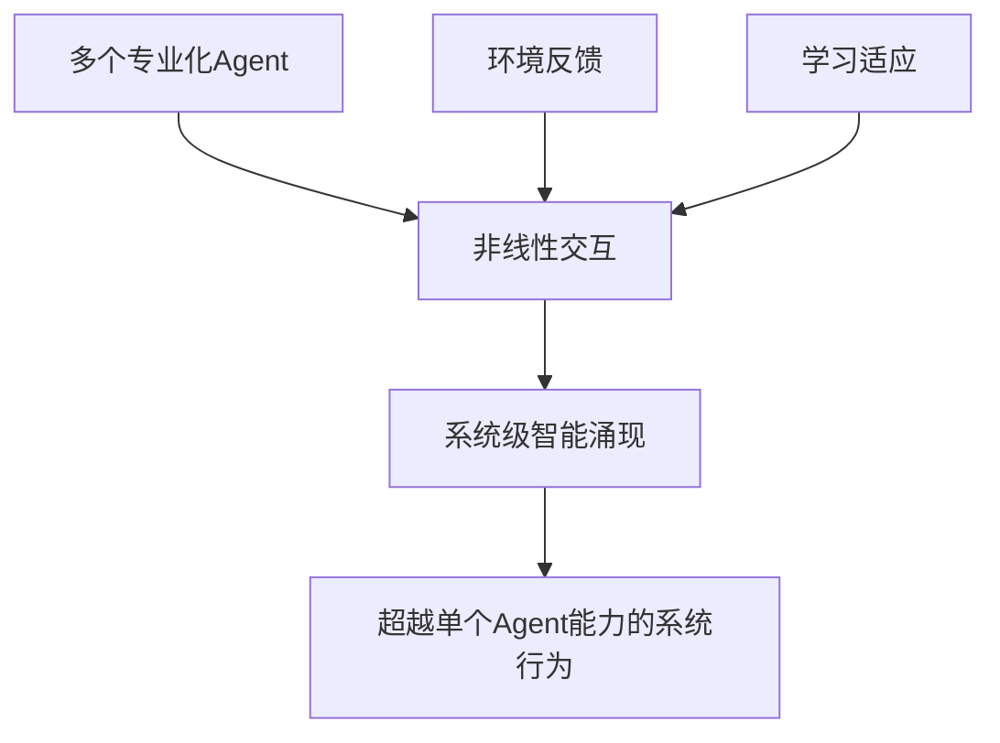
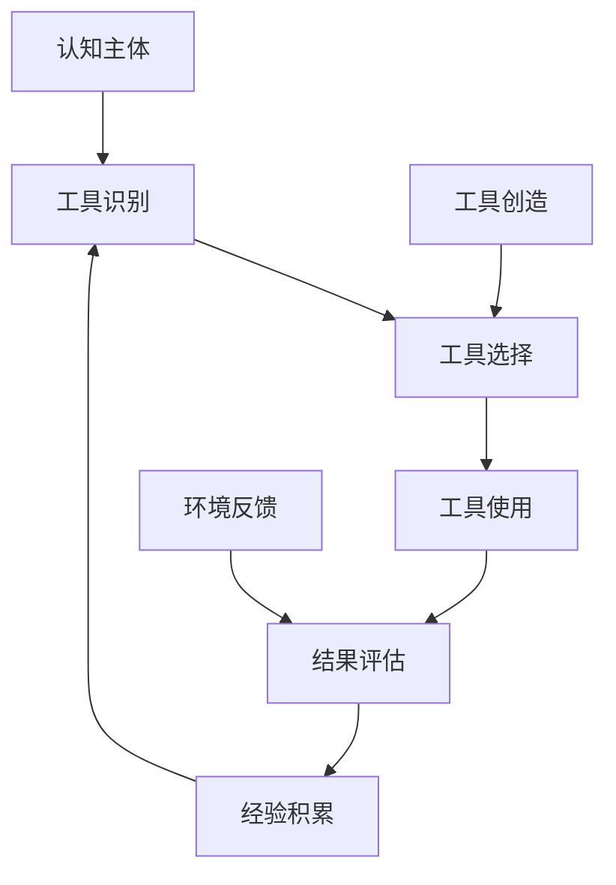

# 0.4 深入理解：理论基础与前沿发展

> **本章重点**：深入探讨Agentic AI的理论基础，了解学术研究前沿和未来发展趋势

## 🎯 章节定位

本章面向希望深入理解Agentic AI理论基础的读者，包括：
- 研究人员和学者
- 技术架构师
- 对理论基础感兴趣的开发者

如果您更关注实践应用，可以跳过本章，直接进入第一部分的技术实现内容。

---

## 🧠 理论基础体系

Agentic AI的概念建立在以下坚实的科学理论基础之上：

### 复杂适应系统理论（Complex Adaptive Systems Theory）

#### 理论来源
- **Santa Fe Institute** 复杂性科学研究
- **核心观点**：复杂系统的整体行为往往超越其组成部分的简单叠加，表现出"涌现"特性
- **数学表述**：系统整体功能 ≠ 各组件功能的线性叠加

#### 在Agentic AI中的应用


**关键洞察**：
- Agentic AI系统的智能不是各个Agent智能的简单相加
- 系统级的智能涌现是设计目标，而非意外产物
- 需要特殊的架构设计来促进和管理涌现现象

### 涌现理论（Emergence Theory）

#### 理论奠基
- **理论奠基人**：Philip Anderson（诺贝尔物理学奖得主）在《More is Different》中提出
- **核心原理**：当系统达到一定复杂度时，会自发产生新的性质和行为模式
- **关键特征**：非线性、自组织、层次性、适应性

#### 涌现的数学模型

**弱涌现**：
```
E(系统) = f(组件1, 组件2, ..., 组件n, 交互关系)
```
其中f是非线性函数，系统行为可以从组件行为推导出来，但需要复杂的计算。

**强涌现**：
```
E(系统) ≠ f(组件1, 组件2, ..., 组件n, 交互关系)
```
系统产生了完全新的、不可从组件行为预测的特性。

#### 在Agentic AI中的体现

**智能涌现的层次**：
1. **功能涌现**：系统获得单个Agent不具备的功能
2. **性能涌现**：系统性能超越各Agent性能的线性叠加
3. **创新涌现**：系统产生创新性的解决方案
4. **适应涌现**：系统获得自适应和自优化能力

### 多智能体系统理论（Multi-Agent Systems Theory）

#### 理论基础
- **分布式人工智能**：研究多个智能实体的协作
- **博弈论**：分析智能体间的策略互动
- **协调理论**：研究如何实现有效的协作

#### 核心机制

**协调机制（Coordination Mechanisms）**：
- **合约网协议**：基于招标的任务分配
- **黑板系统**：共享信息空间的协作
- **市场机制**：基于经济学原理的资源分配

**通信协议（Communication Protocols）**：
- **KQML**：知识查询和操作语言
- **FIPA-ACL**：智能体通信语言标准
- **自定义协议**：针对特定应用的通信协议

#### 在Agentic AI中的创新

传统多智能体系统主要关注**协作效率**，而Agentic AI更关注**智能涌现**：

| 传统多智能体系统 | Agentic AI系统 |
|----------------|---------------|
| 预定义的协作模式 | 动态演化的协作模式 |
| 固定的能力边界 | 能力边界可扩展 |
| 效率优化导向 | 智能涌现导向 |
| 确定性协作 | 概率性协作 |

### 工具使用理论（Tool Use Theory）

#### 理论基础

**认知科学基础**：
- **延展认知理论**（Extended Mind Theory）：Andy Clark & David Chalmers提出，工具成为认知系统的延伸
- **具身认知理论**（Embodied Cognition）：认知过程与身体和环境的交互密不可分
- **分布式认知理论**（Distributed Cognition）：Edwin Hutchins提出，认知能力可以分布在工具和环境中

#### 工具使用的认知模型



#### 在Agentic AI中的应用

**工具创造的三个层次**：
1. **工具组合层**：创新性地组合现有工具
2. **工具生成层**：根据需求动态生成新工具
3. **工具进化层**：通过反馈持续优化工具

**认知科学支撑**：
- 工具使用是智能的重要标志
- 工具创造体现了认知能力的外化
- 工具系统的演化反映了智能的发展

### 系统科学理论

#### 理论依据
- **系统论**：研究系统的结构、功能和行为
- **控制论**：研究系统的控制和调节机制
- **信息论**：研究信息的传输、处理和存储

#### 核心概念
- **整体性**：系统是一个有机整体
- **结构性**：系统内部有特定的结构关系
- **层次性**：系统具有层次化的组织结构
- **开放性**：系统与环境进行物质、能量、信息交换

#### 在Agentic AI中的体现

**系统设计原则**：
- **层次化架构**：五层架构体现了系统的层次性
- **开放性设计**：支持工具的动态扩展和环境适应
- **反馈控制**：通过反馈机制实现系统的自我调节
- **信息集成**：通过知识记忆层实现信息的有效整合

---

## 📚 重要理论文献

### 涌现与复杂系统理论

#### 奠基性文献
1. **Anderson, P. W.** (1972). "More is Different: Broken symmetry and the nature of the hierarchical structure of science." *Science*, 177(4047), 393-396.
   - 涌现理论的奠基性论文，提出"More is Different"原理

2. **Holland, J. H.** (1992). *Adaptation in Natural and Artificial Systems*. MIT Press.
   - 复杂适应系统理论的经典著作

3. **Kauffman, S. A.** (1993). *The Origins of Order: Self-Organization and Selection in Evolution*. Oxford University Press.
   - 自组织理论在复杂系统中的应用

#### 现代发展
4. **Bar-Yam, Y.** (1997). *Dynamics of Complex Systems*. Addison-Wesley.
   - 复杂系统动力学的综合性教材

5. **Mitchell, M.** (2009). *Complexity: A Guided Tour*. Oxford University Press.
   - 复杂性科学的通俗介绍

### 工具使用与认知理论

#### 认知科学基础
6. **Oakley, K. P.** (1949). *Man the Tool-maker*. British Museum (Natural History).
   - 工具使用理论的开创性著作

7. **Clark, A., & Chalmers, D.** (1998). "The Extended Mind." *Analysis*, 58(1), 7-19.
   - 延展认知理论的经典论文

8. **Hutchins, E.** (1995). *Cognition in the Wild*. MIT Press.
   - 分布式认知理论的权威著作

#### 现代研究
9. **Clark, A.** (2008). *Supersizing the Mind: Embodiment, Action, and Cognitive Extension*. Oxford University Press.
   - 延展认知理论的深入发展

### 人工智能理论基础

#### 经典理论
10. **Newell, A., & Simon, H. A.** (1976). "Computer science as empirical inquiry: symbols and search." *Communications of the ACM*, 19(3), 113-126.
    - 物理符号系统假设的经典论文

11. **Brooks, R. A.** (1991). "Intelligence without representation." *Artificial Intelligence*, 47(1-3), 139-159.
    - 行为主义AI和包容架构的重要论文

#### 现代发展
12. **Russell, S., & Norvig, P.** (2020). *Artificial Intelligence: A Modern Approach* (4th ed.). Pearson.
    - AI领域的权威教材

13. **Goodfellow, I., Bengio, Y., & Courville, A.** (2016). *Deep Learning*. MIT Press.
    - 深度学习的权威教材

### 多智能体系统理论

#### 基础理论
14. **Stone, P., & Veloso, M.** (2000). "Multiagent Systems: A Survey from a Machine Learning Perspective." *Autonomous Robots*, 8(3), 345-383.
    - 多智能体系统的机器学习理论基础

15. **Wooldridge, M.** (2009). *An Introduction to MultiAgent Systems*. John Wiley & Sons.
    - 多智能体系统工程实现的权威教材

#### 协作理论
16. **Tambe, M.** (1997). "Towards flexible teamwork." *Journal of Artificial Intelligence Research*, 7, 83-124.
    - 智能体团队协作理论

### 信息论与计算理论

#### 基础理论
17. **Shannon, C. E.** (1948). "A mathematical theory of communication." *Bell System Technical Journal*, 27(3), 379-423.
    - 信息论的奠基性论文

18. **Tononi, G.** (2008). "Integrated information theory." *Scholarpedia*, 3(3), 4164.
    - 信息整合理论

#### 计算理论
19. **Wolfram, S.** (2002). *A New Kind of Science*. Wolfram Media.
    - 计算涌现理论

20. **Arthur, W. B.** (2009). *The Nature of Technology: What It Is and How It Evolves*. Free Press.
    - 技术系统演化理论，为工具创造提供理论基础

---

## 🔬 最新研究进展

### 学术界前沿研究

#### 智能涌现研究
**研究热点**：
- 大规模语言模型中的涌现能力
- 多智能体强化学习中的涌现行为
- 自组织系统的涌现机制

**重要论文**：
- Wei, J., et al. (2022). "Emergent Abilities of Large Language Models." *arXiv preprint*.
- Schrittwieser, J., et al. (2020). "Multi-Agent Deep Reinforcement Learning with Extremely Randomized Trees." *ICML*.

#### 工具学习研究
**研究方向**：
- 大语言模型的工具使用能力
- 自动化工具生成和组合
- 工具使用的安全性和可控性

**重要进展**：
- Toolformer: 教会语言模型使用工具
- ReAct: 推理和行动的结合
- AutoGPT: 自主任务执行系统

#### 多智能体协作研究
**研究前沿**：
- 大语言模型驱动的多智能体系统
- 自适应协作策略学习
- 分布式决策和协调机制

### 工业界应用进展

#### 商业化产品
**代表性产品**：
- **OpenAI GPT-4 with Tools**：集成工具调用能力
- **Anthropic Claude Computer Use**：计算机操作能力
- **Google Gemini Pro**：多模态智能助手

#### 开源项目
**重要项目**：
- **AutoGPT**：自主任务执行框架
- **LangChain**：大语言模型应用开发框架
- **CrewAI**：多智能体协作框架

### 技术发展趋势

#### 短期趋势（2024-2025）
- 工具使用能力的标准化
- 多智能体协作框架的成熟
- 安全性和可控性的增强

#### 中期趋势（2025-2027）
- 智能涌现机制的深入理解
- 自适应学习能力的提升
- 跨领域应用的扩展

#### 长期趋势（2027-2030）
- 通用人工智能的实现
- 人机协作的深度融合
- 智能系统的自主演化

---

## 🎯 理论应用指导

### 如何将理论应用到实践？

#### 复杂适应系统理论的应用
**设计原则**：
- 设计促进涌现的系统架构
- 建立有效的反馈机制
- 支持系统的自组织和适应

**实践方法**：
- 使用分层架构促进涌现
- 实现动态的组件交互机制
- 建立系统级的学习和优化机制

#### 工具使用理论的应用
**设计原则**：
- 构建丰富的工具生态系统
- 支持工具的动态创造和组合
- 实现工具使用的学习和优化

**实践方法**：
- 建立工具注册和管理机制
- 实现工具的自动选择和组合
- 支持工具的动态生成和验证

#### 多智能体理论的应用
**设计原则**：
- 设计有效的协作机制
- 实现智能的任务分配
- 支持动态的协作模式

**实践方法**：
- 使用标准化的通信协议
- 实现智能的协调和调度机制
- 支持协作策略的学习和优化

### 理论指导的系统设计

#### 架构设计
**理论指导**：
- 系统科学理论 → 分层架构设计
- 复杂适应系统理论 → 涌现友好的架构
- 工具使用理论 → 工具扩展运行层设计

#### 算法设计
**理论指导**：
- 涌现理论 → 智能涌现算法
- 多智能体理论 → 协作算法
- 认知科学理论 → 学习算法

#### 评估方法
**理论指导**：
- 复杂系统理论 → 系统级评估方法
- 信息论 → 信息处理效率评估
- 控制论 → 系统稳定性评估

---

## 🔮 未来发展展望

### 理论发展方向

#### 智能涌现理论的深化
**研究问题**：
- 如何量化和预测智能涌现？
- 如何设计更有效的涌现机制？
- 如何控制和引导涌现过程？

**可能突破**：
- 涌现的数学模型和预测方法
- 涌现机制的工程化实现
- 涌现过程的可控性技术

#### 工具创造理论的发展
**研究问题**：
- 如何实现更智能的工具创造？
- 如何保证工具创造的安全性？
- 如何实现工具的自主演化？

**可能突破**：
- 自动化的工具设计和生成
- 工具安全性的形式化验证
- 工具生态系统的自主演化

#### 多智能体协作理论的进步
**研究问题**：
- 如何实现更高效的大规模协作？
- 如何处理协作中的冲突和竞争？
- 如何实现协作策略的自主学习？

**可能突破**：
- 大规模协作的高效算法
- 冲突解决的智能机制
- 协作策略的自适应学习

### 技术发展预测

#### 2025-2027年：理论与实践的深度融合
- 理论指导的系统设计方法成熟
- 智能涌现机制的工程化实现
- 工具创造能力的标准化

#### 2027-2030年：突破性进展
- 通用人工智能的理论突破
- 自主演化系统的实现
- 人机协作的新范式

#### 2030年以后：范式转变
- 智能系统的自主设计和优化
- 人工智能与人类智能的深度融合
- 新的智能形态的出现

---

## 🎯 理论理解检查

### 自我评估

#### 基础理论理解
- [ ] 理解复杂适应系统理论的核心观点
- [ ] 掌握涌现理论的基本概念
- [ ] 了解工具使用理论的认知科学基础
- [ ] 理解多智能体系统理论的核心机制

#### 应用能力评估
- [ ] 能够将理论应用到系统设计中
- [ ] 能够基于理论分析系统行为
- [ ] 能够预测理论发展趋势
- [ ] 能够识别理论与实践的结合点

#### 深度思考能力
- [ ] 能够批判性地分析现有理论
- [ ] 能够提出新的理论假设
- [ ] 能够设计验证理论的实验
- [ ] 能够预测理论的未来发展

### 思考讨论题

1. **理论整合**：如何将不同的理论整合成一个统一的框架？
2. **实践应用**：哪些理论对实际系统设计最有指导意义？
3. **未来发展**：您认为哪个理论方向最有发展前景？
4. **创新思考**：基于现有理论，您能提出什么新的研究方向？

---

## 📖 延伸阅读指引

### 深入学习路径

#### 理论深化
- **复杂系统科学** → Santa Fe Institute的相关课程和研究
- **认知科学** → 工具使用和延展认知的最新研究
- **人工智能理论** → 最新的AI理论发展和突破

#### 实践应用
- **系统设计** → 第二部分：AI应用的开发基础
- **工程实现** → 第四部分：智能化工程
- **案例分析** → 第六部分：参考资料

#### 前沿研究
- **学术论文** → arXiv、ICML、NeurIPS等顶级会议
- **开源项目** → GitHub上的最新Agentic AI项目
- **工业应用** → 各大科技公司的最新产品和技术

### 研究方向建议

#### 对于研究人员
- 关注智能涌现的量化和预测方法
- 研究工具创造的认知机制
- 探索大规模多智能体协作的理论基础

#### 对于工程师
- 学习如何将理论应用到系统设计
- 关注理论指导的工程实践方法
- 探索理论与技术的结合点

#### 对于学生
- 建立扎实的理论基础
- 培养理论与实践结合的能力
- 关注前沿研究动态

---

## 📝 章节总结

本章深入探讨了Agentic AI的理论基础，包括：

### 核心理论体系
- **复杂适应系统理论**：为智能涌现提供理论基础
- **涌现理论**：解释系统级智能的产生机制
- **工具使用理论**：支撑工具创造能力的认知基础
- **多智能体系统理论**：指导协作机制的设计
- **系统科学理论**：提供系统设计的方法论

### 理论应用指导
- 如何将理论转化为系统设计原则
- 如何基于理论进行算法设计
- 如何建立理论指导的评估方法

### 未来发展展望
- 理论发展的可能方向
- 技术突破的预测
- 新范式的展望

这些理论基础不仅帮助我们理解Agentic AI的本质，更为系统设计和技术发展提供了重要指导。

---

> **💡 学习建议**：理论学习需要与实践相结合。建议在学习理论的同时，思考如何将这些理论应用到具体的系统设计和技术实现中。
