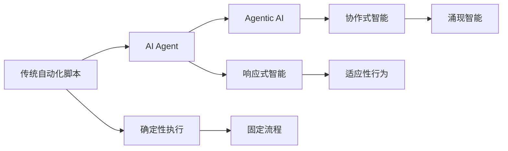
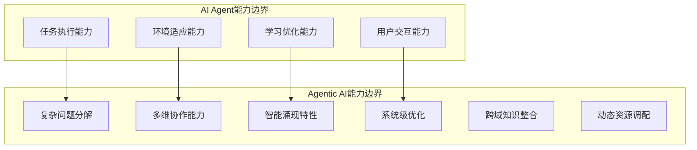
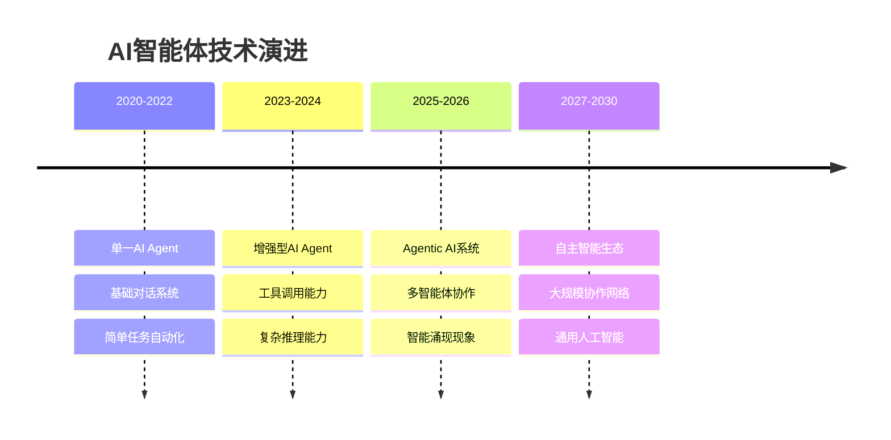

# 从AI Agent到Agentic AI

> **本章重点**：理解AI Agent与Agentic AI的本质区别，建立对智能系统演进路径的准确认知

## 🎯 概念演进概览

在人工智能发展的历程中，我们正在见证从单一智能体（AI Agent）向协作智能系统（Agentic AI）的重要演进。这不仅是技术架构的升级，更是智能系统设计哲学的根本性转变。

---

## 🤖 AI Agent：单体智能的基础形态

### 核心定义

**AI Agent** 是一种自主软件实体，专为在限定的数字环境中执行目标导向的任务而设计。这些Agent能够感知结构化或非结构化的输入，基于上下文信息进行推理，并采取行动以实现特定目标，通常作为人类用户或子系统的替代品。

与遵循确定性工作流程的传统自动化脚本不同，AI Agent具备**响应式智能**和**有限的适应性**，能够解读动态输入并相应地调整输出。

### AI Agent的三大核心特征

AI Agent在架构分类和实际部署中具有三大基础特征：

#### 1. 🔄 自主性（Autonomy）
- **定义**：Agent在部署后能够独立行动，减少对人工干预的依赖
- **价值**：实现大规模的无人值守运行
- **应用场景**：客户服务机器人、日程助手、内容审核系统
- **技术实现**：基于规则引擎、决策树或机器学习模型的自动决策

#### 2. 🎯 任务专一性（Task Specialization）
- **定义**：在特定功能领域内实现高性能优化
- **价值**：在自动化任务中实现高效、可解释、高精度运行
- **应用领域**：日程安排、查询处理、数据过滤、内容分类
- **设计原则**：专业化胜过通用化，深度胜过广度

#### 3. 🎭 反应性与适应性（Reactivity & Adaptability）
- **反应性**：能够响应环境变化（用户指令、软件状态、API响应）
- **适应性**：通过反馈循环、启发式方法或上下文缓冲区更新等方式整合学习机制
- **应用场景**：个性化推荐、对话流程管理、动态内容生成
- **技术基础**：强化学习、在线学习、上下文感知算法

---

## 🌐 Agentic AI：协作智能的新范式

### 概念定义

**Agentic AI** 是一种新兴的智能架构，利用多个专业化Agent协作来实现复杂且高层次的目标。这些系统由模块化的Agent组成，每个Agent负责更广泛目标的一个独特子组件，并通过集中式协调器或去中心化协议进行协调。

这种结构标志着从单一Agent架构中通常观察到的**原子化、响应式行为**向**以动态Agent间协作为特征的系统级智能形式**的概念转变。

### 核心机制解析

#### 🧩 目标分解（Goal Decomposition）
- **机制**：规划Agent自动解析用户指定的目标，并划分为更小、更易于管理的任务
- **分配策略**：子任务被智能分配到Agent网络中的最适合节点
- **动态调整**：根据执行情况实时调整任务分解和分配策略

#### 🔄 多步推理与规划（Multi-step Reasoning & Planning）
- **动态排序**：促进子任务的动态排序和优先级调整
- **实时适应**：系统能够实时适应环境变化或部分任务失败
- **鲁棒执行**：确保即使在不确定性条件下也能鲁棒地执行任务

#### 📡 分布式通信与协调（Distributed Communication & Coordination）
- **通信渠道**：异步消息队列、共享内存缓冲区、中间输出交换
- **协调机制**：实现无需持续集中监督的自主协调
- **容错设计**：具备通信故障恢复和重试机制

#### 🧠 反思性推理与记忆系统（Reflective Reasoning & Memory Systems）
- **上下文存储**：在多次交互中存储和管理上下文信息
- **决策评估**：评估过去的决策效果和策略有效性
- **迭代优化**：基于历史经验迭代优化执行策略

### 智能涌现特性

这些能力共同使得Agentic AI系统能够展现出**灵活、适应性强且协作的智能**，超越了单个Agent的操作限制，产生了**智能涌现**现象。

---

## 🔍 核心差异对比分析

### 综合特征对比

| 特征        | AI Agents        | Agentic AI                        |
| --------- | ---------------- | --------------------------------- |
| **定义**    | 执行特定任务的自主软件程序    | 多个AI智能体协作实现复杂目标的系统                |
| **自主性水平** | 在特定任务范围内具有高度自主性  | 具有广泛的自主性，能够管理多步骤、复杂任务和系统          |
| **任务复杂度** | 通常处理单一、特定的任务     | 处理需要协调的复杂、多步骤任务                   |
| **协作方式**  | 独立运行             | 涉及多智能体信息共享、协作和合作                  |
| **学习与适应** | 在其特定领域内学习和适应     | 在更广泛的任务和环境范围内学习和适应                |
| **应用场景**  | 客户服务聊天机器人、自动化工作流 | 程序开发助手、数据分析助手、供应链管理、业务流程优化、虚拟项目经理 |

### 系统架构层面对比

| 维度 | AI Agent | Agentic AI |
|------|----------|------------|
| **架构模式** | 单体智能体 | 多智能体协作系统 |
| **决策机制** | 独立决策 | 协作决策 |
| **任务处理** | 单任务专精 | 复杂任务分解 |
| **智能表现** | 响应式智能 | 涌现式智能 |
| **扩展性** | 垂直扩展 | 水平扩展 |
| **容错能力** | 单点故障 | 分布式容错 |

### 能力边界对比

---

## 🎯 应用场景差异分析

### AI Agent典型应用场景

#### 🤖 客户支持自动化
- **核心能力**：利用检索增强的LLM和企业知识库
- **主要功能**：自动回答用户查询、处理工单、检索文档
- **价值体现**：提高效率、降低成本、24/7服务可用性
- **技术实现**：RAG架构 + 知识图谱 + 对话管理

#### 📧 智能邮件管理
- **核心能力**：分析邮件内容和元数据
- **主要功能**：自动分类、任务提取、回复建议、优先级排序
- **价值体现**：提高工作效率、减少信息过载
- **技术实现**：NLP + 分类算法 + 规则引擎

#### 📊 个性化推荐系统
- **核心能力**：用户行为分析和兴趣建模
- **主要功能**：内容推荐、数据报告生成、趋势分析
- **价值体现**：提升用户体验、支持数据驱动决策
- **技术实现**：协同过滤 + 深度学习 + 实时计算

#### 📅 智能调度助手
- **核心能力**：日程管理和资源优化
- **主要功能**：会议安排、行程预订、冲突解决
- **价值体现**：提高时间管理效率、优化资源配置
- **技术实现**：约束满足 + 优化算法 + 日历集成

### Agentic AI典型应用场景

#### 🔬 多智能体研究助理
- **系统架构**：文献检索Agent + 内容分析Agent + 写作Agent + 审核Agent
- **协作机制**：流水线协作 + 并行处理 + 质量控制
- **核心价值**：加速科研进程、提高研究质量、知识发现
- **技术挑战**：跨领域知识整合、学术标准保证、创新性评估

#### 🤖 智能机器人协调系统
- **应用领域**：仓库自动化、农业无人机、协作采摘
- **协作模式**：任务分配 + 路径规划 + 实时协调
- **核心价值**：提高生产效率、降低人工成本、优化资源利用
- **技术挑战**：实时通信、环境感知、动态重规划

#### 🏥 协作医疗决策支持
- **系统组成**：诊断Agent + 监测Agent + 治疗规划Agent + 风险评估Agent
- **协作流程**：多维数据融合 + 专家知识整合 + 决策推理
- **核心价值**：提高诊断准确性、优化治疗方案、降低医疗风险
- **技术挑战**：医学知识表示、不确定性处理、伦理约束

#### 🎮 自适应工作流自动化
- **应用场景**：游戏AI、业务流程优化、智能运维
- **协作特点**：动态任务分配 + 自适应策略调整 + 性能优化
- **核心价值**：提升系统智能度、优化用户体验、降低运维成本
- **技术挑战**：策略学习、环境建模、多目标优化

---

## 📈 演进趋势与发展路径

### 技术演进轨迹

### 关键技术突破点

#### 🔧 技术基础设施
- **大语言模型能力提升**：推理能力、工具使用、多模态理解
- **分布式系统技术**：微服务架构、容器化、服务网格
- **通信协议标准化**：Agent间通信、状态同步、协调机制

#### 🧠 智能协作机制
- **任务分解算法**：复杂任务的智能拆分和分配
- **协作策略学习**：多Agent协作模式的自动优化
- **冲突解决机制**：资源竞争和目标冲突的智能处理

#### 🛡️ 可靠性保障
- **容错与恢复**：分布式系统的故障处理和自动恢复
- **性能监控**：多Agent系统的实时监控和调优
- **安全防护**：Agent间通信的安全保障和权限控制

---

## 🎯 概念理解检查

### 核心概念掌握度自测

1. **基础理解**：
   - [ ] 能够准确区分AI Agent和Agentic AI的定义
   - [ ] 理解两者在系统架构上的根本差异
   - [ ] 掌握各自的核心特征和能力边界

2. **深度分析**：
   - [ ] 能够分析具体应用场景适合哪种技术路线
   - [ ] 理解智能涌现现象的产生机制
   - [ ] 掌握多智能体协作的关键技术要素

3. **实践应用**：
   - [ ] 能够设计简单的AI Agent系统
   - [ ] 理解构建Agentic AI系统的技术挑战
   - [ ] 具备选择合适技术方案的判断能力

### 思考讨论题

1. **技术选型**：在什么情况下应该选择AI Agent而非Agentic AI？
2. **架构设计**：如何设计一个可扩展的多智能体协作系统？
3. **未来发展**：您认为Agentic AI技术的下一个突破点在哪里？

---

## 📚 理论基础与参考文献

### 核心理论依据

本文的概念分析基于以下重要研究成果：

#### 多智能体系统理论
- **Wooldridge, M.** (2009). *An Introduction to MultiAgent Systems*. John Wiley & Sons.
- **Stone, P., & Veloso, M.** (2000). "Multiagent Systems: A Survey from a Machine Learning Perspective." *Autonomous Robots*, 8(3), 345-383.

#### 分布式人工智能
- **Bond, A. H., & Gasser, L.** (1988). *Readings in Distributed Artificial Intelligence*. Morgan Kaufmann.
- **Huhns, M. N., & Singh, M. P.** (1998). *Readings in Agents*. Morgan Kaufmann.

#### 智能涌现理论
- **Holland, J. H.** (1998). *Emergence: From Chaos to Order*. Perseus Books.
- **Johnson, S.** (2001). *Emergence: The Connected Lives of Ants, Brains, Cities, and Software*. Scribner.

### 最新研究进展

**援引来源**：康奈尔大学研究团队及其合作者在论文《AI Agents vs. Agentic AI: A Conceptual Taxonomy, Applications and Challenges》中提出的概念框架为本文提供了重要的理论基础。

---

## 📖 延伸阅读指引

### 深入学习路径

- **技术基础** → 第二部分：AI应用的开发基础
  - 2.1 流式通信：理解Agent间的实时通信机制
  - 2.2 异步并发编程：掌握多Agent系统的并发处理
  - 2.3 状态机：学习Agent状态管理和协作流程

- **设计理念** → 第三部分：开发思想与设计哲学
  - 3.1 面向黑盒编程：Agent系统的模块化设计
  - 3.2 鲁棒性设计：多Agent系统的容错机制
  - 3.3 合理分工：Agent间的职责分配和协作模式

- **智能机制** → 第五部分：核心进化
  - 5.1 智能涌现：深入理解Agentic AI的涌现机制
  - 5.2 智能态势感知：多Agent系统的环境感知能力

### 实践案例学习

- **开源项目分析** → 第六部分：参考资料
  - OpenHands多智能体系统架构分析
  - JoyAgent-JDGenie协作机制研究

---

> **💡 学习建议**：理解AI Agent到Agentic AI的演进不仅是技术概念的学习，更是智能系统设计思维的转变。建议结合具体项目实践来深化理解。