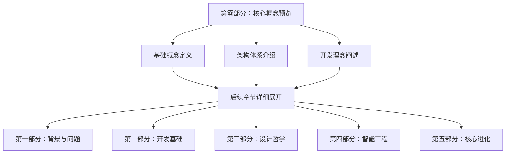

# 0.0 全书概念框架

> **📖 阅读说明**：本章是全书的概念基础，强烈建议所有读者在开始阅读后续章节前仔细阅读本章内容。这将帮助您建立完整的认知框架，避免在后续阅读中遇到概念理解障碍。

## 🎯 本章作用

### 为什么需要第零部分？
在深入AGI应用开发的技术细节之前，读者需要建立完整的概念体系。本书涉及大量创新概念和专业术语，如果缺乏统一的概念基础，容易在阅读过程中产生理解偏差。

### 概念引入的层次化设计

## 📚 学习目标

完成本章学习后，您将能够：

- ✅ 理解AGI应用的核心特征和与传统AI应用的区别
- ✅ 掌握AGI应用五层架构的整体设计思路
- ✅ 建立面向黑盒编程的基本认知
- ✅ 理解"90%软件工程+10%AI"的核心理念
- ✅ 为后续技术章节的学习建立概念基础

## 🔍 概念地图导航

### 🌟 一级核心概念（必须掌握）
- **AGI应用（AGI Application）** - 全书的核心主题
- **智能涌现（Intelligence Emergence）** - AGI应用的本质特征
- **分层架构（Layered Architecture）** - 系统设计的基础框架

### ⚙️ 二级技术概念（重点理解）
- **黑盒编程（Black-Box Programming）** - 核心开发范式
- **流式通信（Stream Communication）** - 关键技术实现
- **状态机（State Machine）** - 复杂性管理工具
- **上下文工程（Context Engineering）** - 智能系统基础
- **智能态势感知（Intelligent Situational Awareness）** - 环境感知与分析能力

### 🎯 三级实践概念（逐步深入）
- **智能思维工程** - 认知过程工程化
- **工具进化** - 动态能力扩展
- **多智能体协作** - 分布式智能实现

---

## 💡 概念理解提示

### 🔗 概念间的逻辑关系
1. **AGI应用** 是目标系统
2. **智能涌现** 是核心特征
3. **分层架构** 是设计框架
4. **黑盒编程** 是实现方法
5. **技术组件** 是具体实现

### 📖 阅读策略建议
- **首次阅读**：重点理解概念定义，不必深究实现细节
- **概念复习**：在阅读后续章节时，随时回顾相关概念定义
- **实践应用**：结合具体项目思考概念的实际应用场景

---

> **⚠️ 重要提醒**：本章的概念定义是全书的标准，后续章节将直接使用这些概念而不再重复定义。如果在阅读过程中遇到概念理解困难，请及时回到本章查阅。
