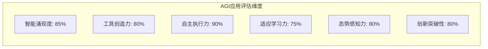

# 0.1 AGI应用核心概念

> **本章重点**：建立对AGI应用的准确认知，理解其与传统AI应用的本质区别

## 🎯 AGI应用的标准定义

### 完整定义
**AGI应用（Artificial General Intelligence Application）** 是指具备智能涌现机制，能够创造出超越原始组件能力的新兴智能，并运用这些涌现能力自主完成任务的应用系统。

### 定义要素解析

#### 1. 智能涌现机制
- **含义**：系统整体智能超越各组成部分的简单叠加
- **表现**：产生预设程序中不存在的新能力
- **数学表示**：`E(系统) > Σ E(组件i) + 交互效应`

#### 2. 工具创造能力
- **动态组合**：根据任务需求重新组合现有工具
- **即时创造**：生成针对特定问题的专用工具
- **进化优化**：通过使用反馈不断改进工具性能

#### 3. 自主任务执行
- **任务分解**：将复杂任务拆分为可执行的子任务
- **独立决策**：在不确定环境中做出合理决策
- **执行控制**：管理整个执行过程的状态和流程

#### 4. 适应性学习
- **环境感知**：实时感知环境变化和用户需求
- **策略调整**：根据反馈动态调整执行策略
- **经验积累**：从历史经验中学习并改进未来表现

#### 5. 智能态势感知
- **状态监控**：实时监控系统内外部状态变化
- **态势分析**：理解当前环境和系统运行态势
- **预测推理**：基于历史数据和当前状态预测未来趋势

## 🔍 与相关概念的区别

### AGI应用 vs 传统AI应用

| 维度 | 传统AI应用 | AGI应用 |
|------|-----------|---------|
| **核心能力** | 执行预定义任务 | 创造性解决问题 |
| **工具使用** | 固定工具集 | 动态创造新工具 |
| **学习方式** | 参数调优 | 策略创新 |
| **适应性** | 有限场景适应 | 开放环境适应 |
| **智能表现** | 单一功能智能 | 涌现式综合智能 |

### AGI应用 vs 多智能体系统

| 特征 | 多智能体系统 | AGI应用 |
|------|-------------|---------|
| **协作关系** | 智能体间协作 | **必须**产生智能涌现 |
| **能力边界** | 各智能体能力叠加 | 超越组件能力边界 |
| **创新能力** | 有限的组合创新 | 突破性能力创造 |

### AGI应用 vs 大语言模型应用

| 层面 | 大语言模型应用 | AGI应用 |
|------|---------------|---------|
| **系统架构** | 以LLM为中心 | 完整的智能生态系统 |
| **能力范围** | 语言理解生成 | 综合问题解决 |
| **工具集成** | 简单工具调用 | 动态工具创造 |

## 🏗️ AGI应用的识别标准

### 核心判断标准

#### ✅ 必备特征（缺一不可）
1. **智能涌现性**：系统表现出超越组件能力的智能行为
2. **工具创造性**：能够动态创造和组合工具
3. **自主执行性**：具备独立的任务执行能力
4. **适应学习性**：能够从经验中学习和改进
5. **态势感知性**：具备对内外环境的实时感知和分析能力

#### 📊 评估维度


### 🧪 简单测试方法

#### 工具创造能力测试
**测试指令**：
```
编写一个程序计算1到99的累加值，执行该程序，报告计算结果，并提供完整代码。
```

**AGI应用的典型响应模式**：
1. **任务分析** → 理解需求包含编程、执行、验证三个步骤
2. **工具创造** → 动态生成计算程序（如Python脚本）
3. **环境准备** → 配置执行环境（如Python解释器）
4. **自主执行** → 运行程序并获取结果
5. **结果验证** → 验证计算结果的正确性（4950）
6. **完整报告** → 提供代码、执行过程和结果

**与传统AI应用的区别**：
- ❌ 传统AI应用：只能生成代码，无法执行
- ✅ AGI应用：完成从创造到执行的完整流程

## 🌟 典型应用案例

### 商业化产品
- **Cursor IDE**：具备代码生成、执行、调试的完整能力

### 开源项目
- **JoyAgent-JDGenie**：京东的多智能体系统，本书主要分析对象


## 🎯 概念理解检查

### 自我检测题目

1. **概念理解**：用自己的话解释什么是智能涌现？
2. **区别辨析**：AGI应用与ChatGPT这类大语言模型应用的核心区别是什么？
3. **实践应用**：在你的工作领域中，哪些场景适合应用AGI应用？

### 理解程度自评
- [ ] **基础理解**：能够准确说出AGI应用的定义
- [ ] **概念区分**：能够区分AGI应用与相关概念
- [ ] **实践思考**：能够识别AGI应用的应用场景
- [ ] **深度理解**：能够分析AGI应用的技术实现挑战

---

## 📖 延伸阅读指引

- **详细架构设计** → 0.2 AGI应用分层架构
- **实现技术基础** → 第二部分：开发基础
- **智能涌现深入** → 第五部分 5.1：智能涌现
- **态势感知能力** → 第五部分 5.2：智能态势感知

---

> **💡 学习提示**：AGI应用概念是全书的基石，建议反复阅读直到完全理解。后续所有技术讨论都基于这一概念展开。
