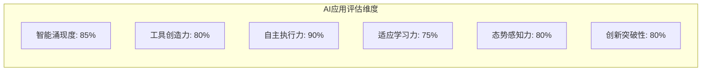

# 0.1 AI应用核心概念

> **本章重点**：建立对AI应用的准确认知，理解其与传统AI应用的本质区别

## 🎯 AI应用的标准定义

### 理论基础

AI应用概念建立在以下坚实的科学理论基础之上：

#### 复杂适应系统理论（Complex Adaptive Systems Theory）
- **理论来源**：Santa Fe Institute 复杂性科学研究
- **核心观点**：复杂系统的整体行为往往超越其组成部分的简单叠加，表现出"涌现"特性
- **数学表述**：系统整体功能 ≠ 各组件功能的线性叠加

#### 涌现理论（Emergence Theory）
- **理论奠基人**：Philip Anderson（诺贝尔物理学奖得主）在《More is Different》中提出
- **核心原理**：当系统达到一定复杂度时，会自发产生新的性质和行为模式
- **关键特征**：非线性、自组织、层次性、适应性

#### 多智能体系统理论（Multi-Agent Systems Theory）
- **理论基础**：分布式人工智能和协作计算理论
- **核心机制**：通过智能体间的交互协作产生集体智能
- **实现途径**：协调机制、通信协议、协作策略

#### 系统科学理论
- **理论依据**：系统论、控制论、信息论的综合应用
- **核心概念**：整体性、结构性、层次性、开放性
- **方法论**：系统分析、系统设计、系统优化

#### 工具使用理论（Tool Use Theory）
- **理论奠基人**：Kenneth Oakley《Man the Tool-maker》(1949)、Benjamin Beck的动物工具使用研究
- **核心观点**：工具的使用和创造是智能的重要标志，体现了认知能力的外化
- **认知科学基础**：
  - **延展认知理论**（Extended Mind Theory）：Andy Clark & David Chalmers提出，工具成为认知系统的延伸
  - **具身认知理论**（Embodied Cognition）：认知过程与身体和环境的交互密不可分
  - **分布式认知理论**（Distributed Cognition）：Edwin Hutchins提出，认知能力可以分布在工具和环境中


### 完整定义

基于上述理论基础，我们将**AI应用（Artificial Intelligence Application）** 定义为：

**一种基于复杂适应系统理论构建的智能应用系统，通过多个专门化智能组件的非线性协作，产生超越各组件独立能力总和的涌现智能，并具备自主任务分解、动态工具创造、适应性学习和智能态势感知等核心能力的应用系统。**

### 定义要素解析

#### 1. 智能涌现机制
- **理论依据**：基于Philip Anderson的涌现理论和Santa Fe Institute的复杂适应系统研究
- **含义**：系统整体智能超越各组成部分的简单叠加
- **表现**：产生预设程序中不存在的新能力
- **数学表示**：
  ```
  E(S) = f(A₁, A₂, ..., Aₙ, I₁₂, I₁₃, ..., Iₙ₋₁,ₙ) + Φ(emergence)
  ```
  其中：
  - E(S)：系统整体智能表现
  - Aᵢ：第i个智能组件的独立能力
  - Iᵢⱼ：组件i与组件j之间的交互效应
  - Φ(emergence)：不可预测的涌现成分（Φ > 0）

#### 2. 工具创造能力
- **动态组合**：根据任务需求重新组合现有工具
- **即时创造**：生成针对特定问题的专用工具
- **进化优化**：通过使用反馈不断改进工具性能

#### 3. 自主任务执行
- **任务分解**：将复杂任务拆分为可执行的子任务
- **独立决策**：在不确定环境中做出合理决策
- **执行控制**：管理整个执行过程的状态和流程

#### 4. 适应性学习
- **环境感知**：实时感知环境变化和用户需求
- **策略调整**：根据反馈动态调整执行策略
- **经验积累**：从历史经验中学习并改进未来表现

#### 5. 智能态势感知
- **状态监控**：实时监控系统内外部状态变化
- **态势分析**：理解当前环境和系统运行态势
- **预测推理**：基于历史数据和当前状态预测未来趋势

## 🔍 与相关概念的区别

### AI应用 vs 传统AI应用

| 维度 | 普通AI Agent | Agentic AI应用 |
|------|-----------|---------|
| **核心能力** | 执行预定义任务 | 创造性解决问题 |
| **工具使用** | 固定工具集 | 动态创造新工具 |
| **学习方式** | 参数调优 | 策略创新 |
| **适应性** | 有限场景适应 | 开放环境适应 |
| **智能表现** | 单一功能智能 | 涌现式综合智能 |
| **任务范围** | 执行预设的单一任务| 处理复杂多变的任务场景 |
		

###  Agentic AI应用 vs 多智能体系统

| 特征 | 多智能体系统 | AI应用 |
|------|-------------|---------|
| **协作关系** | 智能体间协作 | **必须**产生智能涌现 |
| **能力边界** | 各智能体能力叠加 | 超越组件能力边界 |
| **创新能力** | 有限的组合创新 | 突破性能力创造 |

### Agentic AI应用 vs 大语言模型应用

| 层面 | 大语言模型应用 | Agentic AI应用 |
|------|---------------|---------|
| **系统架构** | 以LLM为中心 | 完整的智能生态系统 |
| **能力范围** | 语言理解生成 | 综合问题解决 |
| **工具集成** | 简单工具调用 | 动态工具创造 |

## 🏗️ Agentic AI应用的识别标准

### 核心判断标准

#### ✅ 必备特征（缺一不可）
1. **智能涌现性**：系统表现出超越组件能力的智能行为
2. **工具创造性**：能够动态创造和组合工具
3. **自主执行性**：具备独立的任务执行能力
4. **适应学习性**：能够从经验中学习和改进
5. **态势感知性**：具备对内外环境的实时感知和分析能力

#### 📊 评估维度参考


### 🧪 简单测试方法

#### 工具创造能力测试
**测试指令**：
```
编写一个程序计算1到99的累加值，执行该程序，报告计算结果，并提供完整代码。
```

**AI应用的典型响应模式**：
1. **任务分析** → 理解需求包含编程、执行、验证三个步骤
2. **工具创造** → 动态生成计算程序（如Python脚本）
3. **环境准备** → 配置执行环境（如Python解释器）
4. **自主执行** → 运行程序并获取结果
5. **结果验证** → 验证计算结果的正确性（4950）
6. **完整报告** → 提供代码、执行过程和结果

**与传统AI应用的区别**：
- ❌ 传统AI应用：只能生成代码，无法执行
- ✅ AI应用：完成从创造到执行的完整流程

## 🌟 典型应用案例

### 商业化产品
- **Cursor IDE**：具备代码生成、执行、调试的完整能力

### 开源项目
- **JoyAgent-JDGenie**：京东的多智能体系统，本书主要分析对象


## 🎯 概念理解检查

### 自我检测题目

1. **概念理解**：用自己的话解释什么是智能涌现？
2. **区别辨析**：AI应用与ChatGPT这类AI应用的核心区别是什么？
3. **实践应用**：在你的工作领域中，哪些场景适合应用AI应用？

### 理解程度自评
- [ ] **基础理解**：能够准确说出AI应用的定义
- [ ] **概念区分**：能够区分AI应用与相关概念
- [ ] **实践思考**：能够识别AI应用的应用场景
- [ ] **深度理解**：能够分析AI应用的技术实现挑战

---

## 📚 理论参考文献

### 核心理论文献

#### 涌现与复杂系统理论
1. **Anderson, P. W.** (1972). "More is Different: Broken symmetry and the nature of the hierarchical structure of science." *Science*, 177(4047), 393-396.
   - 涌现理论的奠基性论文，提出"More is Different"原理

2. **Holland, J. H.** (1992). *Adaptation in Natural and Artificial Systems*. MIT Press.
   - 复杂适应系统理论的经典著作

3. **Kauffman, S. A.** (1993). *The Origins of Order: Self-Organization and Selection in Evolution*. Oxford University Press.
   - 自组织理论在复杂系统中的应用

#### 工具使用与认知理论
4. **Oakley, K. P.** (1949). *Man the Tool-maker*. British Museum (Natural History).
   - 工具使用理论的开创性著作

5. **Clark, A., & Chalmers, D.** (1998). "The Extended Mind." *Analysis*, 58(1), 7-19.
   - 延展认知理论的经典论文

6. **Hutchins, E.** (1995). *Cognition in the Wild*. MIT Press.
   - 分布式认知理论的权威著作

#### 人工智能理论基础
7. **Newell, A., & Simon, H. A.** (1976). "Computer science as empirical inquiry: symbols and search." *Communications of the ACM*, 19(3), 113-126.
   - 物理符号系统假设的经典论文

8. **Brooks, R. A.** (1991). "Intelligence without representation." *Artificial Intelligence*, 47(1-3), 139-159.
   - 行为主义AI和包容架构的重要论文

9. **Anderson, J. R.** (2007). *How Can the Human Mind Occur in the Physical Universe?* Oxford University Press.
   - ACT-R认知架构理论

#### 信息论与计算理论
10. **Shannon, C. E.** (1948). "A mathematical theory of communication." *Bell System Technical Journal*, 27(3), 379-423.
    - 信息论的奠基性论文

11. **Tononi, G.** (2008). "Integrated information theory." *Scholarpedia*, 3(3), 4164.
    - 信息整合理论

12. **Wolfram, S.** (2002). *A New Kind of Science*. Wolfram Media.
    - 计算涌现理论

#### 认知心理学理论
13. **Kahneman, D.** (2011). *Thinking, Fast and Slow*. Farrar, Straus and Giroux.
    - 双过程理论的经典著作

14. **Flavell, J. H.** (1976). "Metacognitive aspects of problem solving." *The Nature of Intelligence*, 231-235.
    - 元认知理论的开创性研究

#### 博弈论与决策理论
15. **Von Neumann, J., & Morgenstern, O.** (1944). *Theory of Games and Economic Behavior*. Princeton University Press.
    - 博弈论的奠基性著作

16. **Maynard Smith, J.** (1982). *Evolution and the Theory of Games*. Cambridge University Press.
    - 进化博弈论经典教材

### 技术实现参考
17. **Stone, P., & Veloso, M.** (2000). "Multiagent Systems: A Survey from a Machine Learning Perspective." *Autonomous Robots*, 8(3), 345-383.
    - 多智能体系统的机器学习理论基础

18. **Wooldridge, M.** (2009). *An Introduction to MultiAgent Systems*. John Wiley & Sons.
    - 多智能体系统工程实现的权威教材

19. **Russell, S., & Norvig, P.** (2020). *Artificial Intelligence: A Modern Approach* (4th ed.). Pearson.
    - AI领域的权威教材

20. **Arthur, W. B.** (2009). *The Nature of Technology: What It Is and How It Evolves*. Free Press.
    - 技术系统演化理论，为工具创造提供理论基础


---

## 📖 延伸阅读指引

- **详细架构设计** → 0.2 AI应用分层架构
- **实现技术基础** → 第二部分：开发基础
- **智能涌现深入** → 第五部分 5.1：智能涌现
- **态势感知能力** → 第五部分 5.2：智能态势感知

---

> **💡 学习提示**：AI应用概念是全书的基石，建议反复阅读直到完全理解。后续所有技术讨论都基于这一概念展开。
