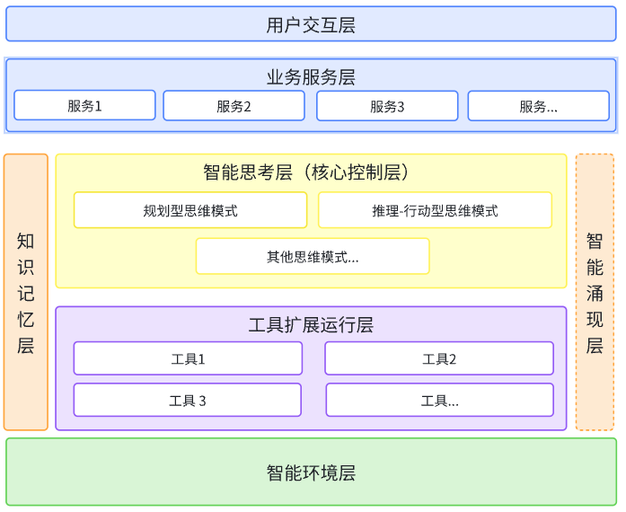

# 0.2 AGI应用分层架构

> **本章重点**：理解AGI应用的五层架构设计，掌握各层的职责分工和协作关系

## 🏗️ 架构总览

AGI应用采用分层架构设计，每层承担特定职责并相互协作，形成智能涌现的基础。

### 📊 AGI应用架构全景图

下图展示了目前在很多类似京东的多智能体项目joyagent-jdgenie已经实现的AGI应用的完整技术架构，涵盖了五个核心层次：

### 📊 关系图谱总览

## 📋 各层详细说明

### 🎨 智能涌现层（Intelligence Emergence Layer）

#### 层次特性
- **类型**：概念性抽象层
- **存在形式**：系统整体行为的抽象表现
- **核心作用**：体现"1+1>2"的协同效应

#### 涌现现象表现

#### 关键特征
- ✨ **非预设性**：产生设计时未预期的智能行为
- 🚀 **创新驱动**：系统创造性和自主性的体现  
- 🔄 **动态演化**：随系统运行不断演化

> **💡 核心要点**：智能涌现层不对应具体代码模块，而是通过多层协作产生的系统性智能现象。

---

### 🧠 智能思维层（Intelligence Thinking Layer）

#### 核心定位
作为系统的**智能决策中心**，基于LLM驱动的智能决策架构，形成LLM智能决策与规则辅助的混合策略，负责决策控制、状态管理、任务执行控制等核心逻辑，将类人认知过程转化为可工程化实现的计算模型。

#### 混合策略架构

#### LLM驱动特性
- **🧠 智能理解**：基于大语言模型的深度语义理解能力
- **🎯 灵活决策**：适应复杂多变场景的智能决策能力  
- **🔄 自主学习**：通过交互反馈持续优化决策质量
- **⚖️ 平衡策略**：LLM创新性与规则确定性的最优平衡

#### 主要职责
1. **任务理解与分析**：解析用户需求，评估任务复杂度
2. **推理规划**：制定执行策略和步骤规划
3. **执行控制**：协调其他层次的协作执行
4. **反思优化**：评估执行结果，优化后续策略
5. **态势感知**：实时监控和分析系统内外环境状态

#### 核心组件

> **📖 详细阐述**：第四部分 4.2节 "智能思维工程"

---

### 💭 知识记忆层（Knowledge Memory Layer）

#### 核心定位
构建和管理应用的**全生命周期知识体系**，提供类人记忆能力。

#### 分层记忆架构

#### 核心能力
- **动态上下文构建**：根据任务需求组装相关信息
- **语义检索**：基于语义相似度的智能检索
- **知识关联推理**：通过知识图谱实现概念关联
- **记忆管理**：智能遗忘和知识更新机制

> **📖 详细阐述**：第四部分 4.1节 "上下文工程"

---

### 🔧 工具扩展运行层（Tool Extension Runtime Layer）

#### 核心定位
AGI应用的**核心执行层**，负责集成、管理和运行所有工具型资源。

#### 主要组件

#### 核心特性
- **资源集成性**：统一管理所有工具资源
- **动态扩展性**：支持工具的动态添加和组合
- **智能编排性**：根据需求自动选择和组合工具
- **创造涌现性**：能够创造超越现有工具的新能力
- **状态感知性**：为态势感知提供系统状态数据支持

---

### 🐳 智能环境层（Intelligent Environment Layer）

#### 核心定位
为AGI应用提供**运行支撑的基础设施层**，构建安全、高效、可扩展的执行环境。

#### 主要组件

#### 核心能力
- **环境隔离**：提供安全的执行环境
- **资源调度**：智能分配和管理系统资源
- **安全保障**：多层次的安全控制机制
- **监控治理**：全面的系统监控和治理能力

---

## 🔄 层间协作关系

### 信息流向图

### 协作原则
1. **自下而上支撑**：每层为上层提供基础能力
2. **双向信息流动**：支持反馈和优化循环
3. **松耦合设计**：层间通过标准接口交互
4. **智能协调**：通过智能思维层统一协调

## 🎯 架构设计原则

### 核心设计原则

#### 1. 分离关注点
- 每层专注于特定的职责领域
- 避免职责重叠和功能冗余
- 支持独立的优化和升级

#### 2. 接口标准化
- 定义清晰的层间接口规范
- 支持不同实现的可替换性
- 保证系统的可扩展性

#### 3. 智能协调
- 通过智能思维层统一决策
- 支持动态的资源分配
- 实现自适应的系统行为

#### 4. 涌现友好
- 为智能涌现现象提供基础
- 支持系统的创新和进化
- 鼓励跨层的协作创新

## 📊 架构评估维度

### 质量属性评估参考

### 关键指标
- **响应时间**：系统对用户请求的响应速度
- **吞吐量**：单位时间内处理的任务数量
- **可用性**：系统正常运行的时间比例
- **扩展性**：支持负载增长的能力
- **创新度**：产生新能力的频率和质量

## 🔍 架构理解检查

### 自我检测
1. **层次理解**：能够说出五个层次的核心职责？
2. **协作关系**：理解层间的信息流向和协作机制？
3. **设计原则**：掌握架构设计的核心原则？
4. **实践应用**：能够基于此架构设计具体系统？

---

## 📖 延伸阅读指引

- **技术实现基础** → 第二部分：AGI应用的开发基础
- **设计哲学深入** → 第三部分：开发思想与设计哲学
- **智能涌现机制** → 第五部分 5.1：智能涌现
- **态势感知能力** → 第五部分 5.2：智能态势感知

---

> **💡 架构理解要点**：分层架构不仅是技术实现的框架，更是理解AGI应用本质的思维工具。每一层都承载着特定的智能功能，协作产生系统级的智能涌现。
