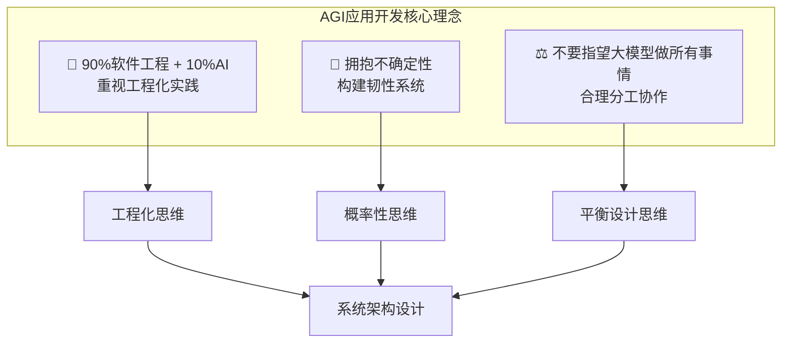
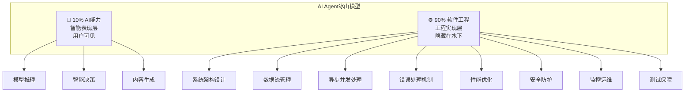
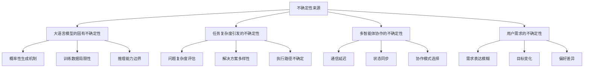
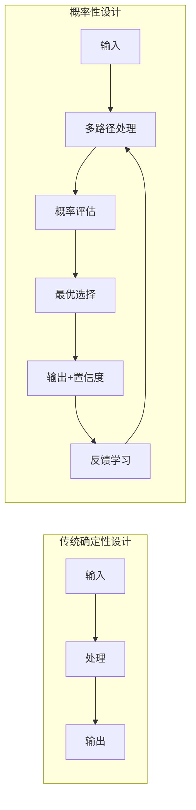
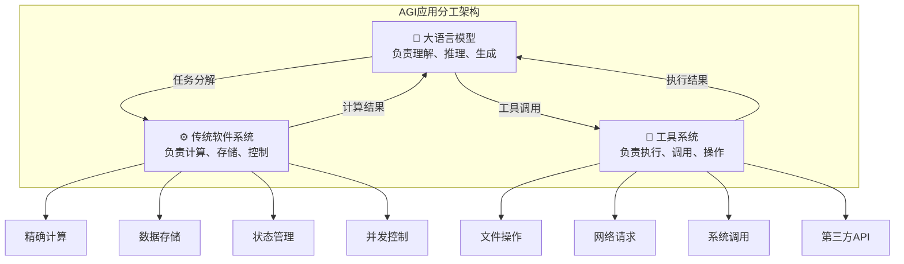
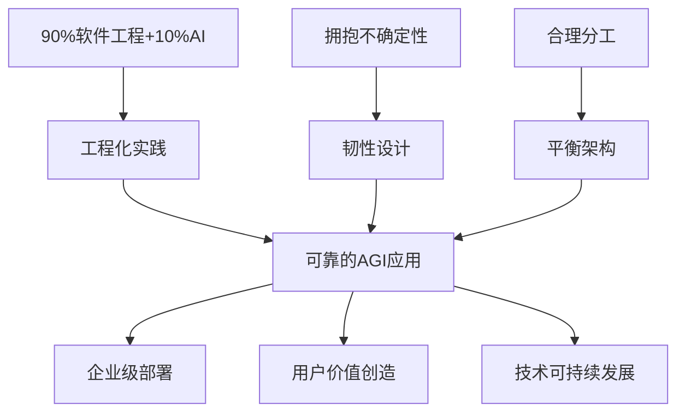

# 0.3 核心开发理念

> **本章重点**：理解AGI应用开发的三大核心理念，建立正确的开发思维模式

## 🎯 三大核心理念概览

AGI应用开发需要全新的思维模式和开发理念。本书提出三大核心理念：

---

## 💼 理念一："90%软件工程 + 10%AI"

### 理念来源
这一深刻洞察由硅谷知名技术专家**Rakesh Gohel**在2025年8月提出：

> **"AI Agents are about 90% Software Engineering and only 10% AI"**
> 
> **"AI智能体，90%是软件工程，只有10%才是AI。"**

### 冰山模型理解

### 实践意义

#### 🔧 重视工程化实践
- **架构设计**：分层架构、模块化设计、接口标准化
- **错误处理**：异常捕获、故障恢复、降级策略
- **性能优化**：并发处理、缓存策略、资源管理

#### 📊 关注系统可靠性
- **监控体系**：实时监控、告警机制、性能分析
- **日志管理**：结构化日志、链路追踪、问题诊断
- **故障恢复**：自动恢复、手动介入、数据备份

#### 🔄 强化开发流程
- **版本管理**：代码版本控制、发布管理、回滚机制
- **测试策略**：单元测试、集成测试、端到端测试
- **部署运维**：持续集成、自动化部署、环境管理

### 思维转换对比

| 传统AI思维 | AGI应用工程思维 |
|-----------|---------------|
| 关注模型性能 | 关注系统可靠性 |
| 算法优化优先 | 架构设计优先 |
| 单点突破 | 系统性工程 |
| 实验室环境 | 生产环境 |
| 准确性导向 | 可用性导向 |

---

## 🤝 理念二：拥抱不确定性

### 不确定性的来源

AGI应用面临多重不确定性挑战：

### 应对策略

#### 🎯 概率性思维
- **从确定性到概率性**：接受输出的概率分布特性
- **置信度评估**：为每个决策提供置信度评分
- **多方案准备**：准备多个候选解决方案

#### 🛡️ 容错设计
- **韧性系统架构**：系统能够承受部分组件失效
- **优雅降级**：在异常情况下提供有限但可用的服务
- **自动恢复**：系统能够自动从错误状态中恢复

#### 🔄 自适应机制
- **动态调整**：根据执行反馈调整策略
- **学习优化**：从历史经验中学习最佳实践
- **环境适应**：根据环境变化调整行为模式

### 设计模式转换

---

## ⚖️ 理念三：不要指望大模型做所有事情

### 大模型的能力边界

#### ✅ 大模型的优势
- **语言理解与生成**：自然语言处理能力
- **知识推理**：基于训练数据的推理能力
- **创意生成**：创造性内容产生能力
- **模式识别**：复杂模式的识别能力

#### ❌ 大模型的局限
- **精确计算**：数值计算容易出错
- **实时数据**：无法获取最新信息
- **系统调用**：无法直接操作系统资源
- **状态管理**：缺乏持续的状态记忆

### 合理分工架构

### 实践原则

#### 🎯 职责分离
- **明确边界**：清晰定义各组件的职责范围
- **接口标准化**：通过标准接口进行交互
- **独立演进**：各组件可以独立优化升级

#### 🔧 优势互补
- **发挥所长**：让每个组件做最擅长的事情
- **弥补不足**：通过组合弥补单一组件的局限
- **协同增效**：实现"1+1>2"的协同效应

#### ⚖️ 平衡设计
- **智能性 vs 可靠性**：在智能程度和系统可靠性间找平衡
- **灵活性 vs 性能**：在系统灵活性和执行性能间找平衡
- **复杂性 vs 可维护性**：在功能复杂性和系统可维护性间找平衡

---

## 🔄 三大理念的协同作用

### 理念间的关系

### 综合实践指导

#### 🏗️ 架构设计阶段
1. **工程思维**：优先考虑系统架构和工程实践
2. **不确定性设计**：为各种不确定性场景做好准备
3. **合理分工**：明确各组件的职责边界

#### 🔧 开发实现阶段
1. **质量优先**：重视代码质量和工程规范
2. **容错机制**：实现完善的错误处理和恢复机制
3. **接口设计**：设计清晰的组件间接口

#### 🚀 部署运维阶段
1. **监控体系**：建立完善的系统监控
2. **自适应运维**：实现系统的自适应调优
3. **持续优化**：基于运行数据持续优化系统

## 🎯 理念理解检查

### 自我评估
1. **理念理解**：能够用自己的话解释三大核心理念？
2. **思维转换**：从传统AI开发思维转向AGI应用工程思维？
3. **实践应用**：能够在实际项目中应用这些理念？

### 理解程度检查
- [ ] **基础认知**：理解三大理念的基本含义
- [ ] **深度理解**：掌握理念背后的设计思想
- [ ] **实践转化**：能够将理念转化为具体实践
- [ ] **综合运用**：能够综合运用三大理念指导开发

---

## 📖 延伸阅读指引

- **工程实践详解** → 第二部分：AGI应用的开发基础
- **不确定性处理** → 第一部分：背景与问题
- **设计哲学深入** → 第三部分：开发思想与设计哲学

---

## 🚀 下一步学习指引

理解了AGI应用开发的三大核心理念后，您可能会思考：**为什么AGI应用开发如此具有挑战性？** 

在第一部分中，我们将深入分析AGI应用开发面临的具体挑战：

- **📊 不确定性分析**：了解大语言模型、任务复杂度、多智能体协作等带来的不确定性
- **🔄 范式转变**：理解从确定性编程到概率性编程的根本性转变
- **⚙️ 技术挑战**：掌握传统软件工程方法在AGI应用中的适应性改造

这些挑战的深入理解，将为您在第二部分学习具体技术解决方案打下坚实基础。

**📖 推荐阅读路径**：
- 如果您是**传统软件开发者** → 重点关注第一部分的范式转变分析
- 如果您是**AI/ML工程师** → 可以快速浏览第一部分，重点准备第二部分的工程实践

---

> **💡 理念内化建议**：这三大理念不仅是技术指导，更是思维模式的转换。建议在每个开发决策中都回顾这些理念，逐步内化为开发习惯。
