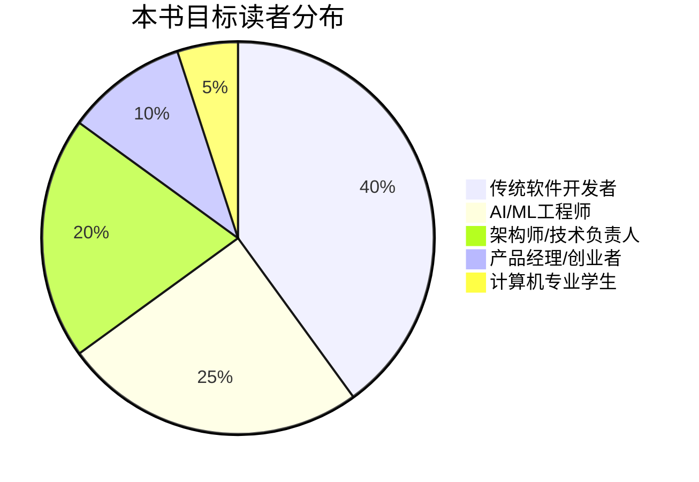
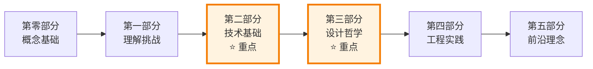
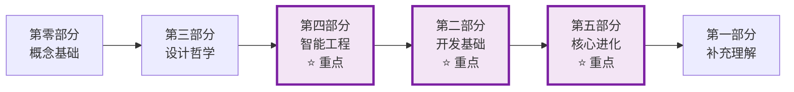
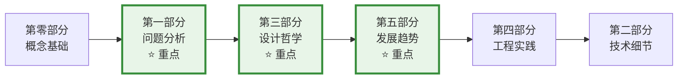
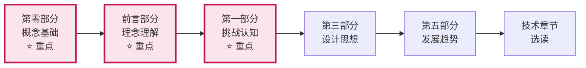
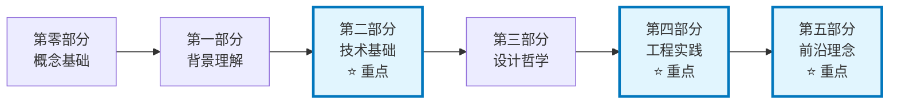

# 0.4 学习路径导航

> **本章重点**：为不同背景的读者提供个性化的学习路径，确保高效的学习体验

## 🎯 读者画像分析

### 📊 目标读者群体

---

## 🛣️ 个性化学习路径

### 👨‍💻 路径一：传统软件开发者

#### 背景特征
- ✅ 具备扎实的软件工程基础
- ✅ 熟悉系统架构设计
- ❓ 对AI/LLM了解有限
- ❓ 缺乏不确定性系统设计经验

#### 🎯 学习目标
转型成为AGI应用开发工程师，掌握在不确定性环境中构建可靠系统的能力。

#### 📚 推荐学习路径

#### 📖 重点关注章节
1. **必读章节** ⭐⭐⭐
   - 2.1 流式通信基础
   - 2.2 异步并发编程
   - 2.3 状态机设计
   - 3.1 面向黑盒编程

2. **重要章节** ⭐⭐
   - 1.2 与传统软件开发的区别
   - 3.2 拥抱不确定性
   - 4.1 上下文工程

3. **扩展阅读** ⭐
   - 5.1 智能涌现
   - 5.2 智能态势感知

#### 🎓 学习建议
- **时间分配**：60%技术实现 + 30%设计理念 + 10%前沿概念
- **实践方式**：结合现有项目思考如何应用AGI技术
- **难点突破**：重点理解概率性编程思维

---

### 🤖 路径二：AI/ML工程师

#### 背景特征
- ✅ 深度理解AI/ML技术
- ✅ 熟悉模型训练和优化
- ❓ 缺乏大规模系统架构经验
- ❓ 工程化实践相对薄弱

#### 🎯 学习目标
掌握将AI能力工程化的方法，构建可部署的企业级AGI应用。

#### 📚 推荐学习路径

#### 📖 重点关注章节
1. **必读章节** ⭐⭐⭐
   - 4.1 上下文工程
   - 4.2 智能思维工程
   - 5.1 智能涌现
   - 3.3 不要指望大模型做所有事情

2. **重要章节** ⭐⭐
   - 2.4 设计模式
   - 3.1 面向黑盒编程
   - 5.2 智能态势感知

3. **补充学习** ⭐
   - 2.1 流式通信
   - 2.2 异步并发编程
   - 2.3 状态机

#### 🎓 学习建议
- **时间分配**：50%智能工程 + 30%系统架构 + 20%前沿理念
- **实践方式**：从模型能力出发，思考如何构建完整系统
- **难点突破**：重点理解软件工程在AGI中的重要性

---

### 🏗️ 路径三：架构师/技术负责人

#### 背景特征
- ✅ 丰富的系统架构经验
- ✅ 技术选型和团队管理能力
- ❓ 对AGI技术特点理解不足
- ❓ 缺乏AI项目管理经验

#### 🎯 学习目标
建立AGI应用的架构设计能力，指导团队进行AGI项目开发。

#### 📚 推荐学习路径

#### 📖 重点关注章节
1. **必读章节** ⭐⭐⭐
   - 1.1 不确定性的来源分析
   - 1.2 与传统软件开发的区别
   - 3.1 面向黑盒编程
   - 5.1 智能涌现

2. **重要章节** ⭐⭐
   - 3.2 拥抱不确定性
   - 3.3 不要指望大模型做所有事情
   - 4.1 上下文工程架构
   - 5.2 智能态势感知

3. **技术参考** ⭐
   - 第二部分各技术章节（按需查阅）

#### 🎓 学习建议
- **时间分配**：40%架构设计 + 30%理念哲学 + 20%趋势分析 + 10%技术细节
- **实践方式**：从企业需求出发，设计AGI应用架构
- **难点突破**：理解AGI应用与传统系统的本质差异

---

### 💼 路径四：产品经理/创业者

#### 背景特征
- ✅ 敏锐的商业嗅觉
- ✅ 产品规划和市场分析能力
- ❓ 技术理解深度有限
- ❓ 对技术实现复杂度认知不足

#### 🎯 学习目标
理解AGI应用的技术本质，做出正确的产品决策和资源投入。

#### 📚 推荐学习路径

#### 📖 重点关注章节
1. **必读章节** ⭐⭐⭐
   - 前言：AGI应用概念
   - 前言：90%软件工程
   - 0.1 AGI应用核心概念
   - 1.1 不确定性的来源

2. **重要理解** ⭐⭐
   - 1.2 与传统软件开发的区别
   - 3.3 不要指望大模型做所有事情
   - 5.1.1 智能涌现的理论基础

3. **趋势参考** ⭐
   - 5.2 智能态势感知
   - 各章节的"发展趋势"部分

#### 🎓 学习建议
- **时间分配**：50%概念理解 + 30%挑战认知 + 20%趋势分析
- **实践方式**：结合市场需求思考AGI应用的商业价值
- **关键理解**：AGI应用开发的复杂性和投入要求

---

### 🎓 路径五：计算机专业学生

#### 背景特征
- ✅ 计算机基础理论扎实
- ✅ 学习能力强，接受新概念快
- ❓ 缺乏实际项目经验
- ❓ 对企业级系统理解不足

#### 🎯 学习目标
建立AGI应用开发的完整知识体系，为未来职业发展做准备。

#### 📚 推荐学习路径

#### 📖 学习建议
- **时间分配**：均衡学习各部分内容
- **实践方式**：通过小项目验证理论学习
- **重点培养**：工程化思维和系统性思考能力

---

## 📋 学习计划模板

### 🗓️ 4周学习计划（传统软件开发者）

#### Week 1: 概念建立
- [ ] 完成第零部分所有章节
- [ ] 理解AGI应用与传统应用的区别
- [ ] 建立基本概念框架

#### Week 2: 技术基础
- [ ] 学习流式通信技术
- [ ] 掌握异步并发编程
- [ ] 理解状态机设计原理

#### Week 3: 设计哲学
- [ ] 理解面向黑盒编程思想
- [ ] 学习不确定性处理策略
- [ ] 掌握系统分工设计原则

#### Week 4: 实践应用
- [ ] 学习上下文工程实践
- [ ] 了解智能涌现机制
- [ ] 制定个人技术发展计划

### 📊 学习进度追踪

#### 知识掌握度自评表
| 知识领域 | 理解程度 | 实践程度 | 待提升点 |
|---------|---------|---------|---------|
| AGI应用概念 | □ 初级 □ 中级 □ 高级 | □ 理论 □ 实践 □ 项目 | |
| 分层架构 | □ 初级 □ 中级 □ 高级 | □ 理论 □ 实践 □ 项目 | |
| 黑盒编程 | □ 初级 □ 中级 □ 高级 | □ 理论 □ 实践 □ 项目 | |
| 流式通信 | □ 初级 □ 中级 □ 高级 | □ 理论 □ 实践 □ 项目 | |
| 状态机设计 | □ 初级 □ 中级 □ 高级 | □ 理论 □ 实践 □ 项目 | |

---

## 🎯 学习效果评估

### 阶段性检查点

#### 🔍 第零部分完成检查
- [ ] 能够准确定义AGI应用
- [ ] 理解五层架构的设计思路
- [ ] 掌握三大核心开发理念
- [ ] 建立了概念间的关联关系

#### 📚 全书学习完成检查
- [ ] 能够设计AGI应用的整体架构
- [ ] 掌握关键技术的实现方法
- [ ] 具备处理不确定性的设计思维
- [ ] 能够指导团队进行AGI项目开发

### 🚀 进阶学习建议

#### 技术深化
- 参与开源AGI项目贡献
- 实现完整的AGI应用原型
- 深入研究特定技术领域

#### 社区参与
- 加入AGI开发者社区
- 分享学习心得和实践经验
- 关注最新技术发展动态

#### 持续学习
- 跟踪本书的更新内容
- 关注相关论文和技术报告
- 参加技术会议和培训

---

## 📖 学习资源推荐

### 📚 补充阅读材料
- **系统架构**：《软件架构师的12项修炼》
- **并发编程**：《Java并发编程实战》
- **设计模式**：《设计模式：可复用面向对象软件的基础》
- **AI基础**：《人工智能：一种现代的方法》

### 🛠️ 实践工具
- **开源项目**：JoyAgent-JDGenie
- **开发环境**：Cursor IDE
- **容器化**：Docker, Kubernetes
- **监控工具**：Prometheus, Grafana

### 🌐 在线资源
- **官方文档**：各AI平台的官方文档
- **技术博客**：相关技术专家的博客
- **视频教程**：技术分享和会议录像
- **代码仓库**：GitHub上的相关项目

---

> **💡 学习提醒**：学习是一个循序渐进的过程，建议根据自己的实际情况调整学习节奏。重要的是理解核心概念和设计思想，而不是急于掌握所有技术细节。
